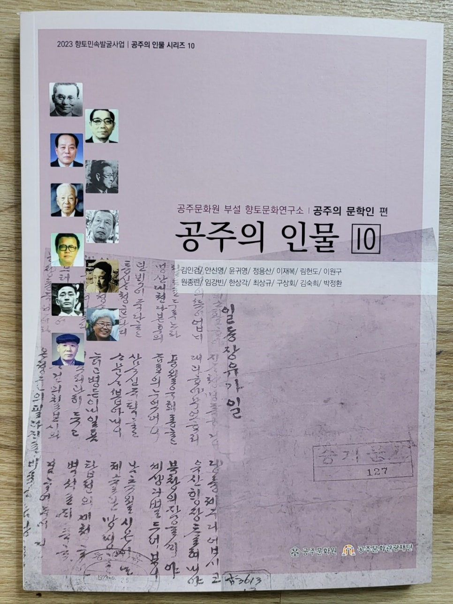
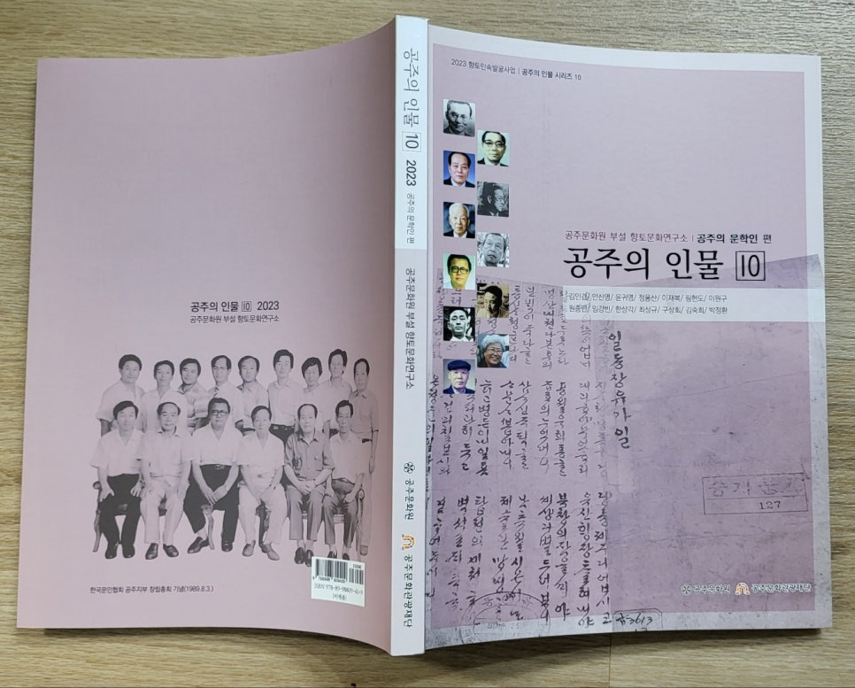
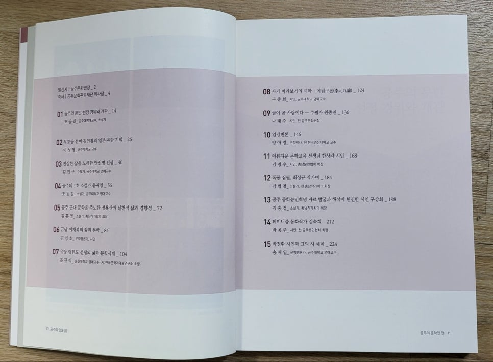
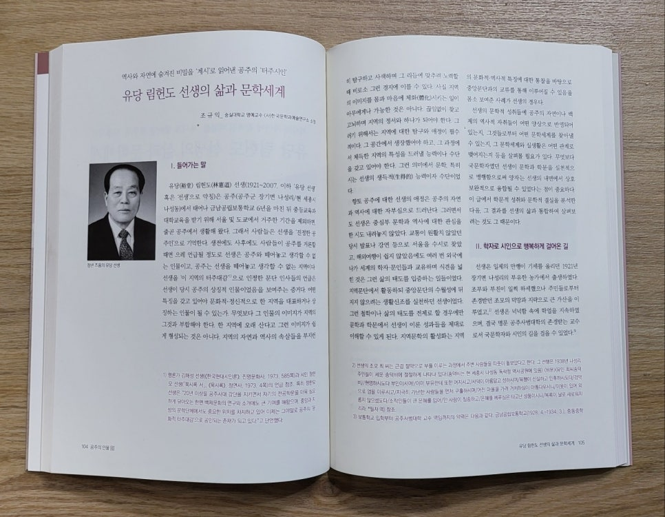

역사와 자연에 숨겨진 비밀을 '계시'로 읽어낸 공주의 '터주시인'

--유당 림헌도 선생의 삶과 문학세계--

​

대학시절 은사이셨던 유당 림헌도 선생의 삶과 문학에 대한 글을 써달라는 청탁을 받고, 처음에는 여러번 고사(固辭)했습니다. 표면적으로 선생과 특수 관계를 맺고있는 점이 혹여 독자들에게 오해를 살 수 있을지 모른다는 우려 때문이었습니다. 그러나 이 문제로 주관처에서 여러 번 논의가 있었는지, 존경하는 선배인 김진규 교수께서 직접 전화를 주셨습니다. 그 분 특유의 간곡하고 온유하신 설득에 넘어가 결국 쓰기로 마음을 바꾸었습니다. 내심으로는 그동안 제대로 읽어보지 않았던 선생의 작품들을 정독하는 기회로 삼아야겠다는 욕심이 작동한 것이지요. 한 작품 한 작품 정독하다 보니, 그간 알지 못했던 선생의 내면이나 고민, 꿈 등이 깨달아지기 시작했습니다. 며칠 동안 시집에 담긴 시작품들을 메모까지 해가면서 통독했습니다. 그제서야 그동안 전혀 알고 있지 못하던 선생의 진면목을 일부분이나마 발견하게 되었습니다.

작고하신지 17년만에야 선생을 제대로 만나뵙게 되었으니, 공주문화원(원장 이일주 박사)과 공주문화관광재단(이사장 이준원 박사)의 기획(공주의 인물)에 감사하고, 저를 필자로 넣어주신 조동길 선배, 김진규 선배 등의 도타우신 덕망에 더 크게 감사드릴 수밖에 없습니다. 이 분들이 자칫 제 고사를 받아 주시어 다른 사람에게 이 글을 쓰게 하셨더라라면, 더 좋은 글은 나왔겠으나 내가 선생과 제대로 재회할 기회는 영영 사라져 버렸을지도 모르겠습니다.

이번 일을 계기로 이제 누구로부터 무슨 부탁을 받는다 해도, '나쁜 일'만 아니라면 무조건 쾌히 받아들여야 한다는 점을 덤으로 깨닫게 되었습니다. 죽으면 썩어 없어질 육신, 아껴서 무엇하리오. 글 몇 자라도 남아 뒷 사람들에게 도움이 된다면, 그보다 더한 영광이 어디에 있겠는지요?

<<공주의 인물 10>> 사진과 제 글을 이곳에 올려두겠습니다. 혹 시간과 마음의 여유가 있으신 분들은 한 번 읽어주시고, 댓글로라도 큰 가르침 주시면 고맙겠습니다.

​

2023. 12. 1

​

백규 조규익 절하고 올림

​

#임헌도 #유당 #공주의\_인물 #공주의\_터주시인 #계시 #공주문화원 #공주문화관광재단 #조동길 #김진규 #죽으면\_썩어질\_육신\_아껴서\_무엇하리오 #이일주 #이준원 #공주 #조규익

​

**첨부파일**

유당 림헌도 선생의 삶과 문학세계-편집본.pdf

[파일 다운로드](https://download.blog.naver.com/open/64f178c8d881805c7190fec6fe1e6316bbeb1af9dd/EFsQbrZIxb7O9dtYLuoSggWaFwbSq-9vdFwMHz1n_gMvGYi9Un4l7_-3DoYO_25b2SKmbkf77mGo9lxDxiewHMB5K4UYU9o/%EC%9C%A0%EB%8B%B9%20%EB%A6%BC%ED%97%8C%EB%8F%84%20%EC%84%A0%EC%83%9D%EC%9D%98%20%EC%82%B6%EA%B3%BC%20%EB%AC%B8%ED%95%99%EC%84%B8%EA%B3%84-%ED%8E%B8%EC%A7%91%EB%B3%B8.pdf)