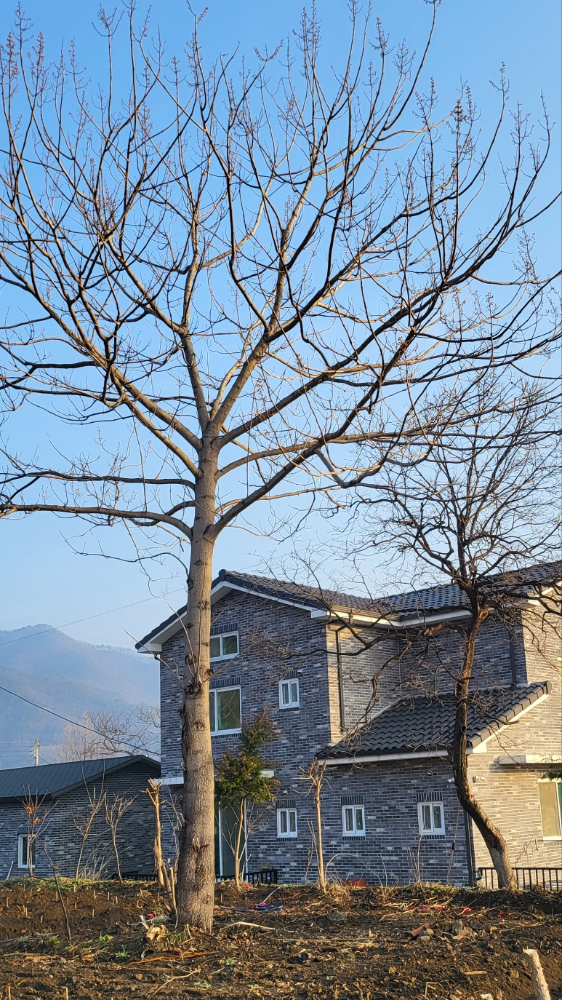

<https://www.chosun.com/opinion/every_single_word/2024/04/12/YGT6RUK2DRET3PM2BEMT5YP7XI/>

[**[일사일언] 오동나무와의 약속**

일사일언 오동나무와의 약속

www.chosun.com](https://www.chosun.com/opinion/every_single_word/2024/04/12/YGT6RUK2DRET3PM2BEMT5YP7XI/)

**오동나무와의 약속**

전원에 집을 짓고 나자, 어디선가 오동나무 씨앗이 날아와 싹이 텄다. 작고 여리던 싹이 어느덧 주변의 초목들을 까마득히 내려다볼 만큼 커졌고, 동네의 명물이 되었다. 그를 유심히 관찰하며, 그의 곁에 갈 때마다 어루만지거나 말을 걸어본다. ‘네가 늙어 혼자 서 있기 어려워질 때쯤 네 몸을 잘라 시집가는 손녀의 장롱을 만들어 주었으면 하는데, 괜찮지?’라고 물어보자, 온몸에 청각 신경이라도 분포되어 있는 듯 즉각 알아들은 그는 내게 반응을 한다. 넓게 퍼진 가지들이 바람의 힘으로 움직이며 ‘그러엄, 기쁘게 내 몸을 내어 줄게’라고 대답하곤 한다.

이곳에 모여 있는 동물과 식물들은 각자의 삶을 살지만, ‘미리 의도하지 않은’ 조화를 이룬다. 그 조화는 소통을 전제로 하고 자연물들 사이의 소통은 공감을 전제로 한다. 매일 닭장의 틈새로 들어와 모이를 훔쳐 먹는 참새들은 내 눈치를 살피고 마음을 떠본다. 녀석들의 움직임을 엿보고 사진이라도 남길 셈으로 창문의 블라인드를 살그머니 올릴라치면, 그걸 어떻게 감지했는지 물 쏟아져 나오듯 닭장 밖으로 내빼곤 한다. 그러다가 잠시 후 별 일 없다고 생각되면 다시 닭장 안으로 몰려 들어간다.

익어가는 감들을 ‘아작 내는’ 어치들도, 밤나무에 구멍을 내느라 바쁜 딱따구리들도, 떼로 몰려다니며 이웃 마을 동족들과 소통하기 바쁜 까마귀와 까치들도, 모두 이곳 생활권의 내 동거자들이다. 대부분 나보다 먼저 이곳에 정착한 그들이다. 내가 그들을 매순간 관찰하듯 그들 또한 내 삶을 관찰해왔음을 최근 깨닫게 되었다. 바람에 날려 헤매다가 우연히 이곳에 정착한 오동나무 씨앗이나 노마드의 유랑을 마치고 이곳으로 들어온 내 처지가 다를 이유는 없다.

인간이 자연을 지배하겠다는 ‘반(反) 생태적’ 의식. 그것은 인간에 의한 인간의 지배에 뿌리를 둔 욕망일 뿐이다. 계급이나 위계질서의 존재는 지배와 복종을 야기하고 세계를 착취의 대상으로 사물화한다고 했다. 생태학자 머리 북친의 주장이다. 지배로부터 자유롭지 못한 사회에서 생태적 행복을 누릴 수는 없다. 자연과 내가 하나이거나 평등하다는 생각은 자연물들과의 공존으로 이어지는 약속이다. 선한 약속은 기적을 낳고, 기적은 우리의 삶을 바꾼다.

#조선일보\_일사일언 #오동나무 #오동나무와의\_약속 #동네의\_명물 #시집가는\_손녀의\_장롱 #미리\_의도하지않은\_조화 #소통 #공감 #참새 #어치 #딱따구리 #까마귀 #까치 #노마드 #노마드의\_유랑 #반생태적\_의식 #인간에\_의한\_인간의\_지배 #욕망 #계급 #위계질서 #지배와\_복종 #생태학자 #북친 #생태적\_행복 #자연과의\_공존 #선한\_약속 #기적