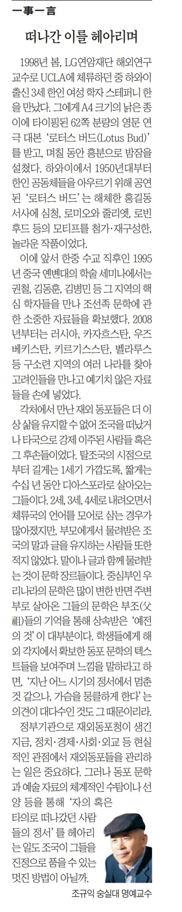

재외동포와 정서적인 교감을

​

1998년 봄, LG연암재단 해외연구교수로 UCLA에 체류하던 중 하와이 출신 3세 한인 여성 학자 스테파니 한을 만났다. 그에게 A4 크기의 낡은 종이에 타이핑된 62쪽 분량의 영문 연극대본 ‘로터스 버드(Lotus Bud)’를 받고, 며칠 동안 흥분으로 밤잠을 설쳤다. 하와이에서 1950년대부터 한인 공동체들을 아우르기 위해 공연된 ‘로터스 버드’는 해체한 홍길동 서사에 심청, 로미오와 줄리엣, 로빈훗 등의 모티프를 첨가·재구성한, 놀라운 작품이었다.

이에 앞서 한중 수교 직후인 1995년 중국 옌볜대의 학술세미나에서는 권철, 김동훈, 김병민 등 그 지역의 핵심 학자들을 만나 조선족 문학에 관한 소중한 자료들을 확보했다. 2008년부터는 러시아, 카자흐스탄, 우즈베키스탄, 키르기스스탄, 벨라루스 등 구소련 지역의 여러 나라들을 찾아 고려인들을 만나고 예기치 않은 자료들을 손에 넣었다.

각처에서 만난 재외 동포들은 더 이상 삶을 유지할 수 없어 조국을 떠났거나 타국으로 강제 이주된 사람들 혹은 그 후손들이었다. 탈조국의 시점으로부터 길게는 1세기 가깝도록 짧게는 수십 년 동안 디아스포라(diaspora)로 살아오는 그들이다. 2세, 3세, 4세로 내려오면서 체류국의 언어를 모어(母語)로 삼는 경우가 많아졌지만, 부모에게게 물려받은 조국의 말과 글을 유지하는 사람들 또한 적지 않았다. 말이나 글과 함께 물려받는 것이 문학 장르들이다. 중심부인 우리나라의 문학은 많이 변한 반면 주변부로 살아온 그들의 문학은 부조(父祖)들의 기억을 통해 상속받은 ‘예전의 것들’이 대부분이다. 학생들에게 해외 각지에서 확보한 동포문학의 텍스트들을 보여주며 느낌을 말하라고 하면, ‘지난 어느 시기의 정서에서 멈춘 것 같으나, 가슴을 뭉클하게 한다’는 의견들이 대다수인 것도 그 때문이리라.

정부기관으로 재외동포청이 생긴 지금. 정치·경제·사회·외교 등 현실적인 관점에서 재외동포들을 관리하는 일은 중요하다. 그러나 동포문학과 예술 자료의 체계적인 수탐이나 선양 등을 통해 ‘자의 혹은 타의로 떠나갔던 사람들의 정서’를 헤아리는 일도 조국이 그들을 진정으로 품을 수 있는 멋진 방법이 아닐까.

조규익 숭실대 명예교수·㈔한국문학과예술연구소장

조선일보 2024년 4월 26일 A18면 일사일언