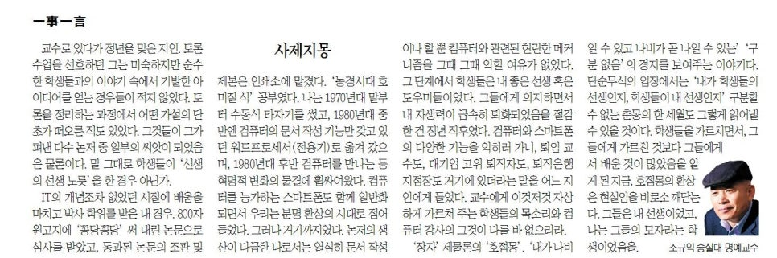

**사제지몽(師弟之夢)**

교수로 있다가 정년을 맞은 지인. 토론 수업을 선호하던 그는 미숙하지만 순수한 학생들과의 이야기 속에서 기발한 아이디어를 얻는 경우들이 적지 않았다. 토론을 정리하는 과정에서 어떤 가설의 단초가 떠오른 적도 있었다. 그것들이 그가 펴낸 다수 논저들 중 일부의 씨앗이 되었음은 물론이다. 말 그대로 학생들이 ‘선생의 선생 노릇’을 한 경우 아닌가.

IT의 개념조차 없었던 시절에 배움을 마치고 박사학위를 받은 내 경우. 800자 원고지에 ‘꽁당꽁당’ 써 내린 논문으로 심사를 받았고, 통과된 논문의 조판 및 제본은 인쇄소에 맡겼다. ‘농경시대 호미질 식’ 공부였다. 나는 70년대 말부터 수동식 타자기를 썼고, 80년대 중반엔 컴퓨터의 문서작성 기능만 갖고 있던 워드프로세서(전용기)로 옮겨 갔으며, 80년대 후반 컴퓨터를 만나는 등 혁명적 변화의 물결에 휩싸여왔다. 컴퓨터를 능가하는 스마트폰도 함께 일반화되면서 우리는 분명 환상의 시대로 접어들었다. 그러나 거기까지였다. 논저의 생산이 다급한 나로서는 열심히 문서작성이나 할 뿐 컴퓨터와 관련된 현란한 메커니즘을 그 때 그 때 익힐 여유가 없었다. 그 단계에서 학생들은 내 좋은 선생 혹은 도우미들이었다. 그들에게 의지하면서 내 자생력이 급속히 퇴화되었음을 절감한 건 정년 직후였다.

컴퓨터와 스마트폰의 다양한 기능을 익히러 가니, 퇴임 교수도, 대기업 고위 퇴직자도, 퇴직은행 지점장도 거기에 있더라는 말을 어느 지인으로부터 들었다. 교수에게 이것저것 자상하게 가르쳐 주는 학생들의 목소리와 컴퓨터 강사의 그것이 다를 바 없으리라.

<<장자(莊子)>> ｢제물론(齊物論)｣의 ‘호접몽(胡蝶夢)’. ‘내가 나비일 수 있고 나비가 곧 나일 수 있는’ ‘구분 없음’의 경지를 보여주는 이야기다. 단순무식의 입장에서는 ‘내가 학생들의 선생인지, 학생들이 내 선생인지’ 구분할 수 없는 춘몽(春夢)의 한 세월도 그렇게 읽어낼 수 있을 것이다. 학생들을 가르치면서, 그들에게 가르친 것보다 그들로부터 배운 것이 많았음을 알게 된 지금, 호접몽의 환상은 현실임을 비로소 깨닫는다. 그들은 내 선생이었고, 나는 그들의 모자라는 학생이었음을.

​

​

<https://www.chosun.com/culture-life/culture_general/2024/06/07/SM2ALMS36BAUPPG2X5JCT2JKQA/>

[**[일사일언] 사제지몽**

일사일언 사제지몽

www.chosun.com](https://www.chosun.com/culture-life/culture_general/2024/06/07/SM2ALMS36BAUPPG2X5JCT2JKQA/)

​