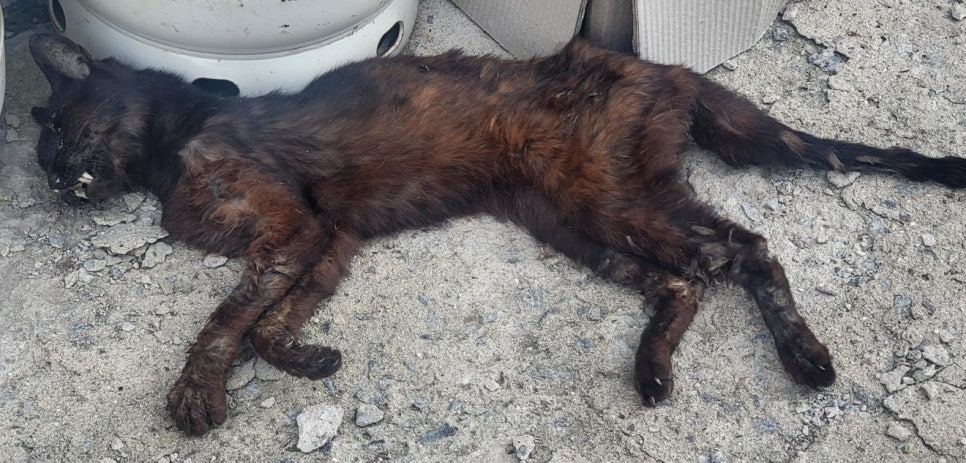

조규익

​

얼마 전부터 내 집을 찾아 끼니를 해결하던 길냥이. 최근 뼈뿐인 몸으로 누가 물었는지 움푹 파인 상처가 딱해보이던 녀석은 신음 속에 숨을 몰아쉬곤 했다. 녀석이 올 때마다 통조림을 건네자, 몇 번 먹고 힘을 차리는 듯 했다. 그 후로 그는 내 집 주변을 떠나지 않았다. 오늘 아침, 뜰에 죽어있는 녀석을 발견했다. 언제부터 그는 이곳을 죽을 자리로 점찍었던 것일까. 깨끗한 한지 석 장으로 앙상한 그를 곱게 싸맸다. 염을 마친 뒤 장례를 치러줬다. 그를 안고 걸어가는 동안 살아있는 내가 죽어있는 나를 안고 가는 듯, 느낌이 묘했다. ‘내가 떠나는 날도 누군가 이렇게 하겠지?’ 중얼거리며 조용히 슬픔을 삭였다.

​

개, 고양이, 닭, 참새, 까치... 수명이 다하거나 앓다가 죽고 상위 포식자들의 공격으로 삶을 마치는 내 집 주변의 동물들. 그들도 생로병사의 경로를 밟는다. 약이라도 먹이거나 발라주고 싶으나, 야생의 그들은 내 손에 잡혀주지 않는다. 기쁠 땐 노래하며 날뛰고, 아플 땐 신음하며 애쓰다가, 죽을 자리 찾아 삶을 마감하는 그들의 일생이 인간과 흡사하지 않은가. 그들에게도 다음 생이 있을까. 독배를 마시고 죽어가며 ‘나는 떠나가네. 그대들은 살기 위해, 나는 죽기 위해. 그러나 우리들 가운데 누가 더 좋은 일을 만나게 될 것인가는 신만이 알 수 있겠지?’라고 중얼거린 소크라테스. 그도 사후세계에 대한 판단을 신에게 미루었다.

​

생명체들이 태어나고 살다가 죽는 과정을 가까이서 관찰하며, 그 과정이 판에 찍은 듯 비극적임을 절감한다. 전원은 자연물들이 어울려 사는 ‘이상공간의 가능태’다. ‘태어남과 떠남’의 고리가 한 순간도 끊어지지 않는 그곳에서 인간 역시 그 구성원들 중 하나일 뿐이다.

​

마지막 고개를 넘는 과정의 고통을 덜고자 깨끗한 물 한 모금과 한 숟갈의 기름진 음식이 필요했던 길냥이. 아픔으로 끙끙대던 그도 마지막엔 죽음을 받아들였다. 먹이그릇 옆에 널브러진 그에게 접근하기를 피하던 그의 동족들도 죽음의 절대성과 공포에 가위눌렸던 것 아닌가. ‘어떻게 살아갈 것인가’ 못지않게 ‘어떤 모습으로 죽어갈 것인가’도 중요함을 새삼 깨닫게 되는 전원의 어둘 녘이다.

​

<https://chosun.app.link/Q2wFA4cRpKb>

[**[일사일언] 길냥이의 마지막 순간**

일사일언 길냥이의 마지막 순간

chosun.app.link](https://chosun.app.link/Q2wFA4cRpKb)

조선일보 20240614 일사일언-조규익