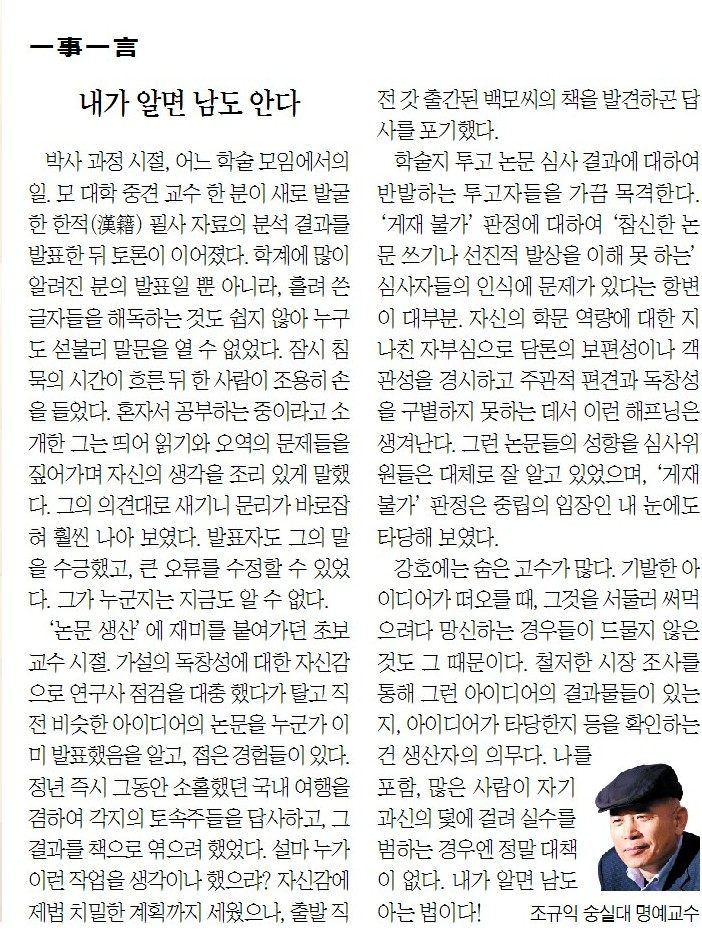
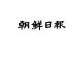

​

박사과정 시절, 어느 학술모임에서의 일. 모 대학 중견 교수 한 분이 새로 발굴한 한적 필사자료의 분석결과를 발표한 뒤 토론이 이어졌다. 학계에 많이 알려진 분의 발표일 뿐 아니라, 흘려 쓴 글자들을 해독하는 것도 쉽지 않아 누구도 섣불리 말문을 열 수 없었다. 잠시 침묵의 시간이 흐른 뒤 한 사람이 조용히 손을 들었다. 혼자서 공부하는 중이라고 소개한 그는 띄어 읽기와 오역의 문제들을 짚어가며 자신의 생각을 조리 있게 말했다. 그의 의견대로 새기니 문리가 바로잡혀 훨씬 나아보였다. 발표자도 그의 말을 수긍했고, 큰 오류를 수정할 수 있었다. 그가 누군지는 지금도 알 수 없다.

‘논문 생산’에 재미를 붙여가던 초보 교수 시절. 가설의 독창성에 대한 자신감으로 연구사 점검을 대충 했다가 탈고 직전 비슷한 아이디어의 논문을 누군가 이미 발표했음을 알고, 접은 경험들이 있다. 정년 즉시 그동안 소홀했던 국내여행을 겸하여 각지의 토속주들을 답사하고, 그 결과를 책으로 엮으려 했었다. 설마 누가 이런 작업을 생각이나 했으랴? 자신감에 제법 치밀한 계획까지 세웠으나, 출발 직전 갓 출간된 백 모씨의 책을 발견하곤 답사를 포기했다.

학술지 투고 논문 심사결과에 대하여 반발하는 투고자들을 가끔 목격한다. ‘게재불가’의 판정에 대하여 ‘참신한 논문 쓰기나 선진적 발상을 이해 못하는’ 심사자들의 인식에 문제가 있다는 항변이 대부분. 자신의 학문 역량에 대한 지나친 자부심으로 담론의 보편성이나 객관성을 경시하고 주관적 편견과 독창성을 구분하지 못하는 데서 이런 해프닝은 생겨난다. 그런 논문들의 성향을 심사위원들은 대체로 잘 알고 있었으며, ‘게재불가’ 판정은 중립의 입장인 내 눈에도 타당해 보였다.

강호에는 숨은 고수들이 많다. 기발한 아이디어가 떠오를 때, 그것을 서둘러 써먹으려다 망신하는 경우들이 드물지 않은 것도 그 때문이다. 철저한 시장조사를 통해 그런 아이디어의 결과물들이 있는지, 아이디어가 타당한지 등을 확인하는 건 생산자의 의무다. 나를 포함, 많은 사람들이 자기 과신의 덫에 걸려 실수를 범하는 경우엔 정말 대책이 없다. 내가 알면 남도 아는 법이다!

​

<https://www.chosun.com/culture-life/culture_general/2024/06/21/G7NLZMFNWNDN5DNZSUQO3LIBSI/>

[**[일사일언] 내가 알면 남도 안다**

일사일언 내가 알면 남도 안다

www.chosun.com](https://www.chosun.com/culture-life/culture_general/2024/06/21/G7NLZMFNWNDN5DNZSUQO3LIBSI/)

​