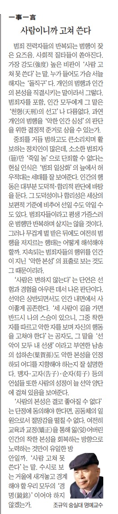

범죄 전력자들의 반복되는 범행이 잦은 요즈음. 사회적 질타들이 쏟아진다. 가장 강도(强度) 높은 비판이 ‘사람 고쳐 못 쓴다’는 말. 누가 들어도 가슴 서늘해지는 ‘돌직구’다. 개인의 범행과 인간의 본성을 직결시키는 말이라서 그렇다. 범죄자를 포함, 인간 모두에게 그 말은 ‘천형(天刑)의 선고’나 다름없다. 과연 개인의 범행을 ‘악한 인간 심성’의 판단을 위한 결정적 준거로 삼을 수 있는가.

중죄를 거듭 범하고도 큰소리치며 활보하는 정치인들이 많은데, 소소한 범죄자(들)만 ‘죽일 놈’으로 단죄할 수 없다는 현실인식은 ‘범죄 일상화’의 늪에서 허우적대는 세태를 잘 보여준다. 인간의 행동은 대부분 도덕적・합리적 판단에 바탕을 둔다. 그 도덕성이나 합리성은 세상의 보편적 기준에 비추어 선일 수도 악일 수도 있다. 범죄자들이라고 평생 가증스런 범행만 반복하며 살지는 않을 것이다. 그러나 무겁게 벌 받은 뒤에도 여전히 범행을 저지르는 행태는 어떻게 해석해야 할까. 지속되는 범죄자들의 행위를 인간이 지닌 ‘악한 본성’의 표출로 보는 것도 그 때문이리라.

‘사람은 변하지 않는다’는 단언은 선험과 경험을 아우른 데서 나온 판단이다. 선・악은 상반되면서도 인간 내면에서 사이좋게 공존한다. ‘세 사람이 길을 가면 반드시 나의 스승이 있으니, 그 중 착한 자를 따르고 악한 자를 보며 자신의 행동을 고쳐야 한다’는 공자도, 그 말을 ‘선과 악이 모두 내 선생’이라고 부연한 남송의 섭하손(葉賀孫)도 악한 본성을 인정하되 어디를 지향해야 하는지 잘 설명한다. 맹자・고자(告子)・순자(荀子) 등의 언설들 또한 사람의 성정이 늘 선악 양단에 걸쳐 있음을 보여준다.

‘사람의 성정은 결코 좋아질 수 없다’는 단정에 동의해야 한다면, 공동체의 일원으로서 절망감을 떨칠 수 없다. 여전히 교육과 교정(矯正)을 통해 잃(잊)어버린 인간의 착한 본성을 회복하는 방향으로 노력하는 것만이 유일한 방안일까. ‘사람 고쳐 못 쓴다’는 말. 수시로 보는 거울에 새겨놓고 경계해야 할 우리 모두의 ‘경명(鏡銘)’일 수 있지 않겠는가.

​

<https://www.chosun.com/culture-life/culture_general/2024/07/05/4VKEIINC6REUDLP44HQ6FWVXEQ/>

[**[일사일언] 사람이니까 고쳐 쓴다**

일사일언 사람이니까 고쳐 쓴다

www.chosun.com](https://www.chosun.com/culture-life/culture_general/2024/07/05/4VKEIINC6REUDLP44HQ6FWVXEQ/)

조선일보 20240705 일사일언 조규익