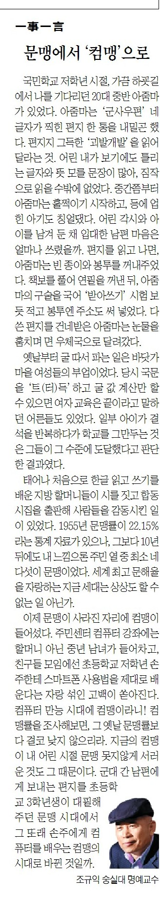

국민학교 저학년 시절, 가끔 하굣길에서 나를 기다리던 20대 중반 아줌마가 있었다. 아줌마는 ‘군사우편’ 네 글자가 찍힌 편지 한 통을 내밀곤 했다. 편지지 그득한 ‘괴발개발’을 읽어달라는 것. 어린 내가 보기에도 틀리는 글자와 뜻 모를 문장들이 많아, 짐작으로 읽을 수밖에 없었다. 중간쯤부터 아줌마는 훌쩍이기 시작하고, 등에 업힌 아기도 칭얼댔다. 어린 각시와 아이를 남겨 둔 채 입대한 남편의 마음은 얼마나 쓰렸을까. 편지를 읽고나면, 아줌마는 빈 종이와 봉투를 꺼내주었다. 책보를 풀어 연필을 꺼낸 뒤, 아줌마의 구술을 국어 ‘받아쓰기’ 시험 보듯 적고 봉투엔 주소도 써넣었다. 다 쓴 편지를 건네받은 아줌마는 눈물을 훔치며 면소재지 우체국으로 달려갔다.

옛날부터 굴 따서 파는 일은 바닷가 마을 여성들의 부업이었다. 따낸 굴을 중간상에게 넘기면 수입이 쏠쏠했다. 당시 국문을 ‘트(터)득’하고 굴 값 계산만 할 수 있으면 여자 교육은 끝이라고 말하던 어른들도 있었다. 일부 아이가 결석을 반복하다가 학교를 그만 두는 것은 그들이 그 수준에 도달했다고 판단한 결과였다.

태어나 처음으로 한글 읽고 쓰기를 배운 지방 할머니들이 시를 지어 합동시집을 출판하거나, 그들의 글씨가 대통령 연하장 글꼴로 채택되어 사람들을 감동시킨 일이 있었다. 1955년 문맹률이 22.15%라는 통계자료가 있으나, 그보다 10년 뒤의 내 느낌으론 주민 열 중 최소 네다섯이 문맹이었다. 세계 최고의 문해율을 자랑하는 지금 세대는 상상도 할 수 없는 일 아닌가.

이제 문맹이 사라진 자리에 컴맹이 들어섰다. 주민 센터 컴퓨터 강좌에는 할머니 아닌 중년 남녀가 들어차고, 친구들 모임에선 초등학교 저학년 손주한테 스마트폰 사용법을 제대로 배운다는 자랑 섞인 고백이 쏟아진다. 컴퓨터 만능의 시대에 컴맹이라니! 컴맹률을 조사해보면, 그 옛날 문맹률보다 결코 낮지 않으리라. 지금의 컴맹이 내 어린 시절 문맹 못지않게 서러운 것도 그 때문이다. 군대 간 남편에게 보내는 편지를 국민학교 3학년생이 대필해주던 문맹의 시대에서 그 또래 손주에게 컴퓨터를 배우는 컴맹의 시대로 바뀐 것일까.

​

<https://www.chosun.com/culture-life/culture_general/2024/08/09/LNGZLBOG4NCHTBZSLAURD2PMUY/>

[**[일사일언] 문맹에서 ‘컴맹’으로**

일사일언 문맹에서 컴맹으로

www.chosun.com](https://www.chosun.com/culture-life/culture_general/2024/08/09/LNGZLBOG4NCHTBZSLAURD2PMUY/)

​