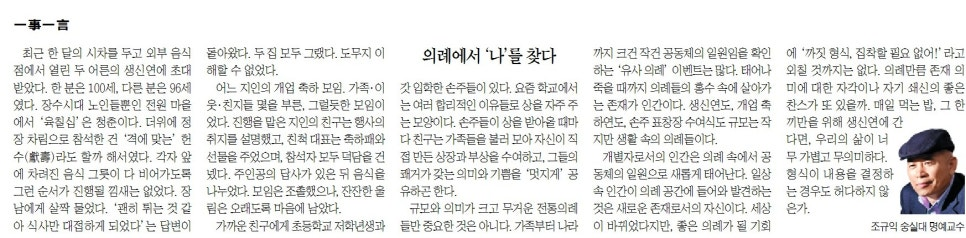

최근 한 달의 시차를 두고 외부 음식점에서 열린 두 어른의 생신 연에 초대받았다. 한 분은 100세, 다른 분은 96세였다. 노인들뿐인 장수시대 전원 마을에서 ‘육칠십’은 청춘이다. 더위에 정장 차림으로 참석한 건 ‘격에 맞는’ 헌수(獻壽)라도 할까 해서였다. 각자 앞에 차려진 음식 그릇들이 다 비어가도록 그런 순서가 진행될 낌새는 없었다. 장남에게 살짝 물었다. ‘괜히 튀는 것 같아 식사만 대접하게 되었다’는 답변이 돌아왔다. 두 집 모두 그랬다. 도무지 이해할 수 없었다.

​

어느 지인의 개업 축하 모임. 가족・이웃・친지들 몇을 부른, 그럴듯한 모임이었다. 진행을 맡은 지인의 친구는 행사의 취지를 설명했고, 친척 대표는 축하패와 선물을 주었으며, 참석자 모두 덕담을 건넸다. 주인공의 답사가 있은 뒤 음식을 나누었다. 모임은 조촐했으나, 잔잔한 울림은 오래도록 마음에 남았다.

​

가까운 친구에게 초등학교 저학년생과 갓 들어간 손주들이 있다. 요즘 학교에서는 여러 합리적인 이유들로 상을 자주 주는 모양이다. 손주들이 상을 받아올 때마다 친구는 가족들을 불러 모아 자신이 직접 만든 상장과 부상을 수여하고, 그들의 쾌거가 갖는 의미와 기쁨을 ‘멋지게’ 공유하곤 한다.

규모와 의미가 크고 무거운 전통의례들만 중요한 것은 아니다. 가족부터 나라까지 크건 작건 공동체의 일원임을 확인하는 ‘유사 의례’ 이벤트는 많다. 태어나 죽을 때까지 의례들의 홍수 속에 살아가는 존재가 인간이다. 생신 연도, 개업 축하연도, 손주 표창장 수여식도 규모는 작지만 생활 속의 의례들이다.

​

개별자로서의 인간은 의례 속에서 공동체의 일원으로 새롭게 태어난다. 일상 속 인간이 의례 공간에 들어와 발견하는 것은 새로운 존재로서의 자신이다. 세상이 바뀌었다지만, 좋은 의례가 될 기회에 ‘까짓 형식, 집착할 필요 없어!’라고 외칠 것까지는 없다. 의례만큼 존재의미에 대한 자각이나 자기쇄신의 좋은 찬스가 또 있을까. 매일 먹는 밥, 그 한 끼만을 위해 생신 연에 간다면, 우리의 삶이 너무 가볍고 무의미하다. 형식이 내용을 결정하는 경우도 허다하지 않은가.

<https://www.chosun.com/culture-life/culture_general/2024/08/16/Y2RQSXSWTZGUNJRMP3X4VCAZUM/>

[**[일사일언] 의례에서 ‘나’를 찾다**

일사일언 의례에서 나를 찾다

www.chosun.com](https://www.chosun.com/culture-life/culture_general/2024/08/16/Y2RQSXSWTZGUNJRMP3X4VCAZUM/)

​