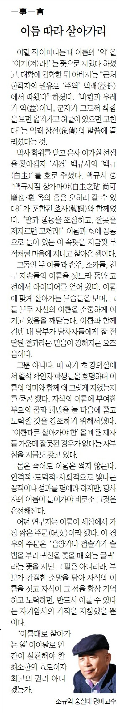

어릴 적 어머니는 내 이름의 ‘익’을 ‘이기(겨)라!’는 뜻으로 지었다 하셨고, 대학에 입학한 뒤 아버지는 ‘근처 한학자의 권유로 <<주역>> 익괘(益卦)에서 따왔다’ 하셨다. ‘바람과 우레가 익(益)이니, 군자가 그로써 착함을 보면 옮겨가고 허물이 있으면 고친다’는 익괘 상전(象傳)의 말씀에 끌리셨다는 것.

박사학위를 받고 은사 이가원 선생을 찾아뵙자 <<시경>> <백규시>의 ‘백규(白圭)’를 호로 주셨다. <백규시> 중 ‘백규지점 상가마야(白圭之玷 尙可磨也/흰 옥의 흠은 오히려 갈 수 있다)’가 포함된 호사(號詞)와 함께였다. ‘말과 행동을 조심하고, 잘못을 저지르면 고쳐라!’ 이름과 호에 공통으로 들어 있는 이 속뜻을 지금껏 부적처럼 마음에 지니고 살아온 셈이다.

그동안 두 아들과 손주, 조카들, 친구 자손들의 이름을 짓느라 동양 고전에서 아이디어를 얻어 왔다. 이름에 맞게 살아가는 모습들을 보며, 그들 모두 자신의 이름을 소중하게 여기고 있음을 깨닫는다. 이름과 함께 건넨 내 당부가 당사자들에게 잘 전달된 결과라는 믿음이 강해지는 요즈음이다.

그 뿐 아니다. 매 학기 초 강의실에서 출석 확인 차 학생들을 호명하며 이름의 의미와 함께 왜 그렇게 지었는지를 묻곤 했다. 자식의 이름에 부여한 부모의 꿈과 희망을 늘 마음에 품고 노력할 것을 강조하기 위해서였다. ‘이름대로 살아가야 함’을 배운 제자들 가운데 잘못된 경우가 없다는 자부심을 지금도 갖고 있다.

몸은 죽어도 이름은 썩지 않는다. 인격적・도덕적・사회적으로 빛나는 공적이나 성과를 명예라 하지만, 당사자의 이름이 들어가야 비로소 그것은 온전해진다. 어떤 연구자는 이름이 세상에서 가장 짧은 주문(呪文)이라 했다. 이 경우의 주문은 ‘음양가나 점술가가 술법을 부려 귀신을 쫓을 때 외는 글귀’라는 뜻을 지닌 그 말은 아니리라. 부모가 간절한 소망을 담아 자식의 이름을 짓고 자식이 그 점을 항상 기억하고 노력하면, 반드시 이룰 수 있다는 자기암시의 기적을 지칭했을 뿐이다. ‘이름대로 살아가는 일’이야말로 인간이 실천해야 할 최소한의 효도이자 최고의 권리 아니겠는가.

​

<https://www.chosun.com/culture-life/culture_general/2024/08/30/24RRYKHJN5FRFASEOPPS7TKMTE/>

[**[일사일언] 이름 따라 살아가리**

일사일언 이름 따라 살아가리

www.chosun.com](https://www.chosun.com/culture-life/culture_general/2024/08/30/24RRYKHJN5FRFASEOPPS7TKMTE/)

​