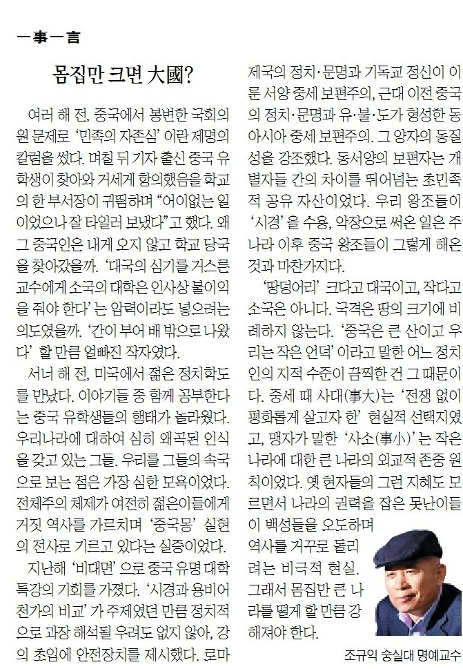

여러 해 전, 중국에서 봉변한 국회의원 문제로 ‘민족의 자존심’이란 제명의 칼럼을 썼다. 며칠 뒤 기자 출신 중국 유학생이 찾아와 거세게 항의했음을 학교의 한 부서장이 귀띔하며, ‘어이없는 일이었으나 잘 타일러 보냈다’고 했다. 왜 그 중국인은 내게 오지 않고 학교 당국을 찾아갔을까. ‘대국의 심기를 거스른 교수에게 소국의 대학은 인사 상 불이익을 줘야 한다’는 압력이라도 넣으려는 의도였을까. ‘간이 부어 배 밖으로 나왔다’ 할 만큼 얼빠진 작자였다.

서너 해 전, 미국에서 젊은 정치학도를 만났다. 이야기들 중 함께 공부한다는 중국 유학생들의 행태가 놀라웠다. 우리나라에 대하여 심히 왜곡된 인식을 갖고 있는 그들. 우리를 그들의 속국으로 보는 점은 가장 심한 모욕이었다. 전체주의 체제가 여전히 젊은이들에게 거짓 역사를 가르치며 ‘중국몽’ 실현의 전사로 기르고 있다는 실증이었다.

지난 해 ‘비대면’으로 중국 유명 대학 특강의 기회를 가졌다. ‘시경과 용비어천가의 비교’가 주제였던 만큼 정치적으로 과장 해석될 우려도 없지 않아, 강의 초입에 안전장치를 제시했다. 로마제국의 정치・문명과 기독교 정신이 이룬 서양 중세 보편주의, 근대 이전 중국의 정치・문명과 유・불・도가 형성한 동아시아 중세 보편주의. 그 양자의 동질성을 강조했다. 동・서양의 보편자는 개별자들 간의 차이를 뛰어넘는 초민족적 공유 자산이었다. 우리 왕조들이 ‘시경’을 수용, 악장으로 써온 일은 주나라 이후 중국 왕조들이 그렇게 해온 것과 마찬가지다.

‘땅덩어리’ 크다고 대국이고, 작다고 소국은 아니다. 국격은 땅의 크기에 비례하지 않는다. ‘중국은 큰 산이고 우리는 작은 언덕’이라고 말한 어느 정치인의 지적 수준이 끔찍한 건 그 때문이다. 중세 때 사대(事大)는 ‘전쟁 없이 평화롭게 살고자 한’ 현실적 선택지였고, 맹자가 말한 ‘사소(事小)’는 작은 나라에 대한 큰 나라의 외교적 존중 원칙이었다. 옛 현자들의 그런 지혜도 모르면서 나라의 권력을 잡은 못난이들이 백성들을 오도하며 역사를 거꾸로 돌리려는 비극적 현실. 그래서 몸집만 큰 나라를 떨게 할 만큼 강해져야 한다.

​

​

<https://www.chosun.com/culture-life/culture_general/2024/09/13/T45Q53AR2ZDW5MXFO3KLS2CQAI/>

[**[일사일언] 몸집만 크면 大國?**

일사일언 몸집만 크면 大國

www.chosun.com](https://www.chosun.com/culture-life/culture_general/2024/09/13/T45Q53AR2ZDW5MXFO3KLS2CQAI/)

​