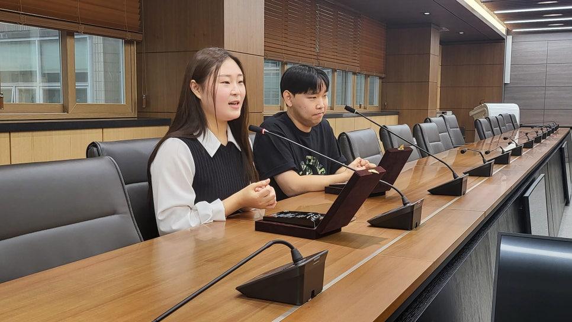
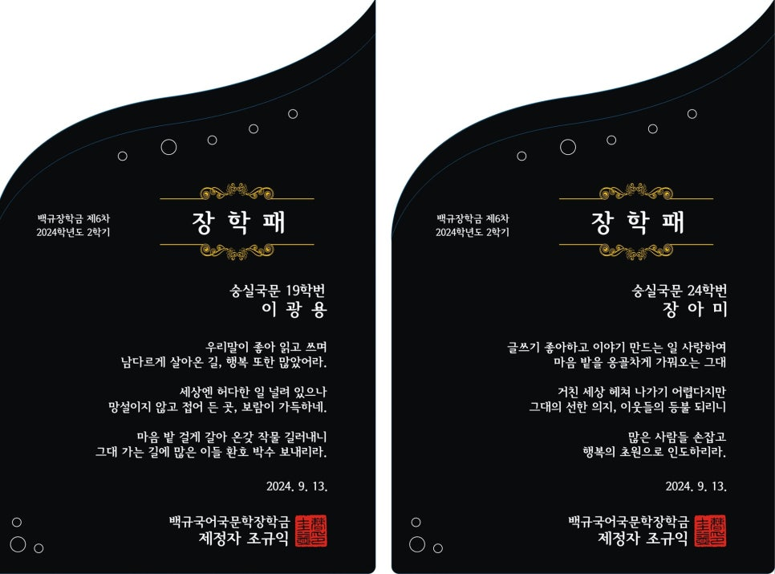
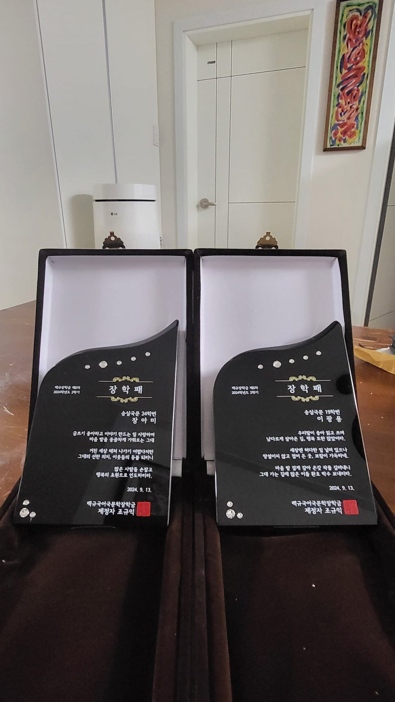
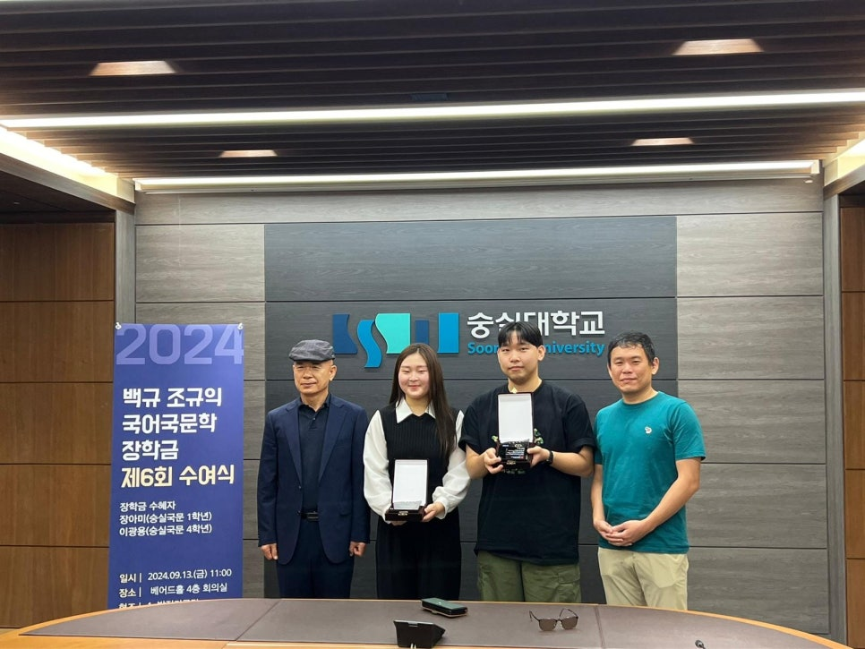
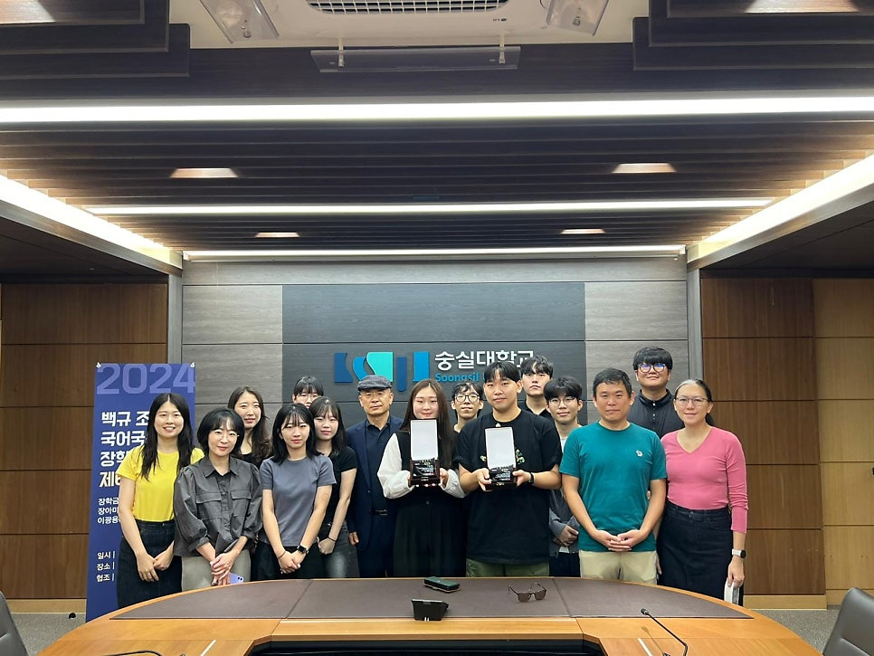
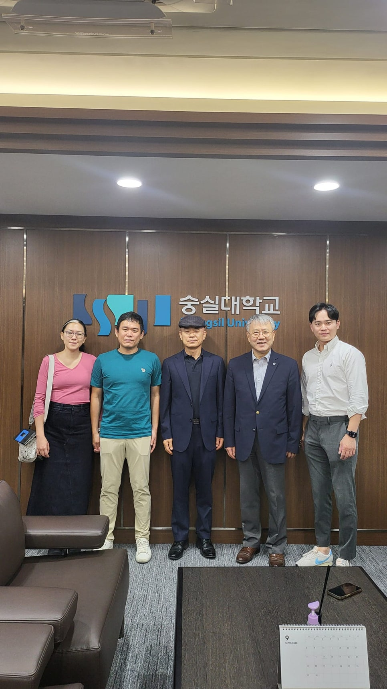

2024년 9월 13일 금요일.

​

추석 귀성 교통 체증이 겁나서 번개같이 서울에 올라갔다 내려왔습니다.

장학생 두 명[국어국문학과 24학번 장아미/19학번 이광용])에게 장학패를 건네는 마음이 즐겁고 행복했습니다.

그들에게 약간이라도 도움이 되었으면 좋겠습니다.

​

그나저나 장학패를 전할 때마다 반 년의 세월이 성큼성큼 지나는군요.

자라게 하는 것도 시간의 힘이요, 물러가게 하는 것도 시간의 힘이라.

자연의 원리가 '전진과 퇴출'의 반복에 있음을 절감하며,

어떻게 사는 것이 정답일까를 내려오는 고속도로 위에서 고민해보았습니다.

장학금 수혜자 장아미, 이광용

좌로부터 린다, 조경현 교수, 조규익, 장범식 총장, 조원정 대표