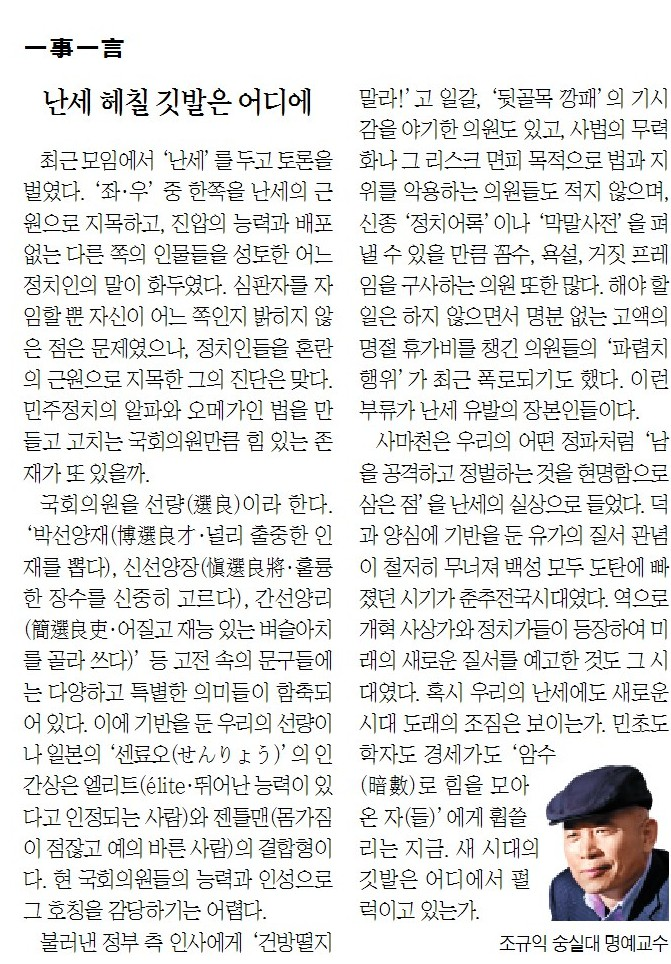

최근 모임에서 난세를 두고 토론을 벌였다. ‘좌우’ 중 한 쪽을 난세의 근원으로 지목하고, 진압의 능력과 배포 없는 다른 쪽의 인물들을 성토한 어느 정치인의 말이 화두였다. 심판자를 자임할 뿐 자신이 어느 쪽인지 밝히지 않은 점은 문제였으나, 정치인들을 혼란의 근원으로 지목한 그의 진단은 맞다. 민주정치의 알파와 오메가인 법을 만들고 고치는 국회의원만큼 힘 있는 존재가 또 있을까.

​

국회의원을 선량(選良)이라 한다. ‘박선양재(博選良才/널리 출중한 인재를 뽑다)・신선양장(愼選良將/훌륭한 장수를 신중히 고르다)・간선양리(簡選良吏/어질고 재능 있는 벼슬아치를 골라 쓰다)’ 등 고전 속의 문구들에는 다양하고 특별한 의미들이 함축되어 있다. 이에 기반을 둔 우리의 선량이나 일본의 ‘센료오(せんりょう)’의 인간상은 엘리트(élite・뛰어난 능력이 있다고 인정되는 사람)와 젠틀맨(몸가짐이 점잖고 예의 바른 사람)의 결합형이다. 현 국회의원들의 능력과 인성으로 그 호칭을 감당하기는 어렵다.

​

불러낸 정부 측 인사에게 ‘건방떨지 말라!’고 일갈, ‘뒷골목 깡패’의 기시감을 야기한 의원도 있고, 사법의 무력화나 그 리스크 면피 목적으로 법과 지위를 악용하는 의원들도 적지 않으며, 신종 ‘정치어록’이나 ‘막말사전’을 펴낼 수 있을 만큼 꼼수・욕설・거짓 프레임을 구사하는 의원들 또한 많다. 해야 할 일은 하지 않으면서 명분 없는 고액의 명절 휴가비를 챙긴 의원들의 ‘파렴치행위’가 최근 폭로되기도 했다. 이런 부류가 난세 유발의 장본인들이다.

사마천은 우리의 어떤 정파처럼 ‘남을 공격하고 정벌하는 것을 현명함으로 삼은 점’을 난세의 실상으로 들었다. 덕과 양심에 기반을 둔 유가의 질서관념이 철저히 무너져 백성 모두 도탄에 빠졌던 시기가 춘추전국시대였다. 역으로 개혁 사상가와 정치가들이 등장하여 미래의 새로운 질서를 예고한 것도 그 시대였다. 혹시 우리의 난세에도 새로운 시대 도래의 조짐은 보이는가. 민초도 학자도 경세가도 ‘암수(暗數)로 힘을 모아온 자(들)’에게 휩쓸리는 지금. 새 시대의 깃발은 어디에서 펄럭이고 있는가.

​

<https://www.chosun.com/culture-life/culture_general/2024/09/20/KVISXD7W4NB4TL6NW5AUNSU47U/>

[**[일사일언] 난세 헤칠 깃발은 어디에**

일사일언 난세 헤칠 깃발은 어디에

www.chosun.com](https://www.chosun.com/culture-life/culture_general/2024/09/20/KVISXD7W4NB4TL6NW5AUNSU47U/)

​