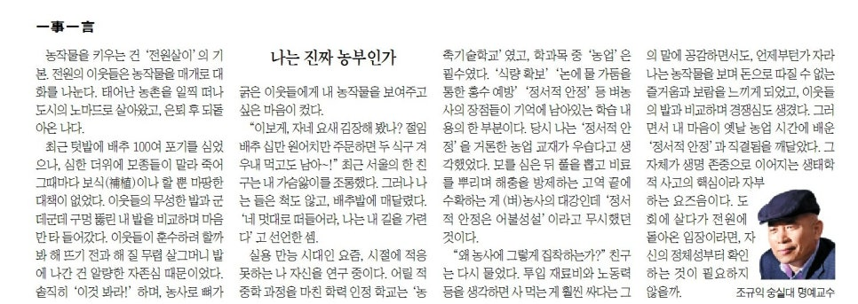

농작물을 키우는 건 ‘전원살이’의 기본. 전원의 이웃들은 농작물을 매개로 대화를 나눈다. 태어난 농촌을 일찍 떠나 도시의 노마드로 살아왔고, 은퇴 후 되돌아온 나다. 최근 텃밭에 배추 100여 포기를 심었으나, 심한 더위에 모종들이 말라 죽어 그 때마다 보식(補植)이나 할 뿐 마땅한 대책이 없었다. 이웃들의 무성한 밭과 군데군데 구멍 뚫린 내 밭을 비교하며 마음만 타들어갔다. 이웃들이 훈수하려 할까봐 해 뜨기 전과 해 질 무렵 살그머니 밭에 나간 건 알량한 자존심 때문이었다. 솔직히 ‘이것 봐라!’ 하며, 농사로 뼈가 굵은 이웃들에게 내 농작물을 보여주고 싶은 마음이 컸다.

​

‘이보게, 자네 요새 김장해 봤나? 절임배추 십 만원어치만 주문하면 두 식구 겨우내 먹고도 남어~!’ 최근 서울의 한 친구는 내 마음앓이를 조롱했다. 그러나 나는 들은 척도 않고, 배추밭에 매달렸다. ‘네 멋대로 떠들어라. 나는 내 길을 가련다’고 선언한 셈.

​

실용 만능 시대인 요즘, 시절에 적응 못하는 나 자신을 연구 중이다. 어릴 적 중학과정을 마친 학력인정학교는 ‘농축기술학교’였고, 학과목들 중 ‘농업’은 필수였다. ‘식량 확보/논에 물 가둠을 통한 홍수 예방/정서적 안정’ 등 벼농사의 장점들이 기억에 남아있는 학습 내용의 한 부분이다. 당시 나는 ‘정서적 안정’을 거론한 농업 교재가 우습다고 생각했었다. 모를 심은 뒤 풀을 뽑고 비료를 뿌리며 해충을 방제하는 고역 끝에 수확하는 게 (벼)농사의 대강인데, ‘정서적 안정은 어불성설’이라고 무시했던 것이다.

​

‘왜 농사에 그렇게 집착하는가?’ 친구는 다시 물었다. 투입 재료비와 노동력 등을 생각하면 사먹는 게 훨씬 싸다는 그의 말에 공감하면서도, 언제부턴가 자라나는 농작물을 보며 돈으로 따질 수 없는 즐거움과 보람을 느끼게 되었고, 이웃들의 밭과 비교하며 경쟁심도 생겼다. 그러면서 내 마음이 옛날 농업 시간에 배운 ‘정서적 안정’과 직결됨을 깨달았다. 그 자체가 생명존중으로 이어지는 생태학적 사고의 핵심이라 자부하는 요즈음이다. 도회에 살다가 전원에 돌아온 입장이라면, 자신의 정체성부터 확인하는 것이 필요하지 않을까.

​

​

<https://www.chosun.com/culture-life/culture_general/2024/09/27/HYVALDHHE5H53INRZSVCREQFBI/>

[**[일사일언] 나는 진짜 농부인가**

일사일언 나는 진짜 농부인가

www.chosun.com](https://www.chosun.com/culture-life/culture_general/2024/09/27/HYVALDHHE5H53INRZSVCREQFBI/)

​