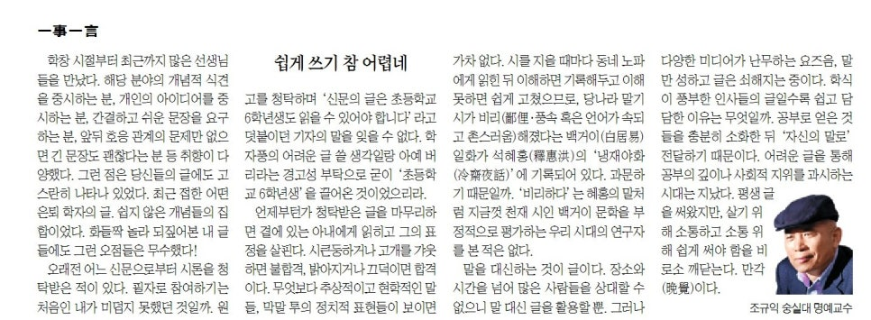

학창시절부터 최근까지 많은 선생님들을 만났다. 해당분야의 개념적 식견을 중시하는 분, 개인의 아이디어를 중시하는 분, 간결하고 쉬운 문장을 요구하는 분, 앞뒤 호응관계의 문제만 없으면 긴 문장도 괜찮다는 분 등 취향이 다양했다. 그런 점은 당신들의 글에도 고스란히 나타나 있었다. 최근 접한 어떤 은퇴 학자의 글. 쉽지 않은 개념들의 집합이었다. 화들짝 놀라 되짚어본 내 글들에도 그런 오점들은 무수했다!

​

오래 전 어느 신문으로부터 시론을 청탁받은 적이 있다. 필자로 참여하기는 처음인 내가 미덥지 못했던 것일까. 원고를 청탁하며 ‘신문의 글은 초등학교 6학년생도 읽을 수 있어야 합니다.’라고 덧붙이던 기자의 말을 잊을 수 없다. 학자풍의 어려운 글 쓸 생각일랑 아예 버리라는 경고성 부탁으로 굳이 ‘초등학교 6학년생’을 끌어온 것이었으리라.

​

언제부턴가 청탁받은 글을 마무리하면 곁에 있는 아내에게 읽히고 그의 표정을 살핀다. 시큰둥하거나 고개를 갸웃하면 불합격, 밝아지거나 끄덕이면 합격이다. 무엇보다 추상적이고 현학적인 말들, 막말 투의 정치적 표현들이 보이면 가차 없다. 시를 지을 때마다 동네 노파에게 읽힌 뒤 이해하면 기록해두고 이해 못하면 쉽게 고쳤으므로, 당나라 말기 시가 비리(鄙俚・풍속 혹은 언어가 속되고 촌스러움)해졌다는 백거이(白居易) 일화가 석혜홍(釋惠洪)의 ‘냉재야화(冷齋夜話)’에 기록되어 있다. 과문하기 때문일까. ‘비리하다’는 혜홍의 말처럼 지금껏 천재시인 백거이 문학을 부정적으로 평가하는 우리 시대의 연구자를 본 적은 없다.

​

말을 대신하는 것이 글이다. 장소와 시간을 넘어 많은 사람들을 상대할 수 없으니 말 대신 글을 활용할 뿐. 그러나 다양한 미디어가 난무하는 요즈음, 말만 성하고 글은 쇠해지는 중이다. 학식이 풍부한 인사들의 글일수록 쉽고 담담한 이유는 무엇일까. 공부로 얻은 것들을 충분히 소화한 뒤 ‘자신의 말로’ 전달하기 때문이다. 어려운 글을 통해 공부의 깊이나 사회적 지위를 과시하는 시대는 지났다. 평생 글을 써왔지만, 살기 위해 소통하고 소통 위해 쉽게 써야 함을

비로소 깨닫는다. 만각(晩覺)이다.

​

​

<https://www.chosun.com/culture-life/culture_general/2024/10/04/D5QSQM2G2FGJBJ4HOD2FNG2HSQ/>

[**[일사일언] 쉽게 쓰기 참 어렵네**

일사일언 쉽게 쓰기 참 어렵네

www.chosun.com](https://www.chosun.com/culture-life/culture_general/2024/10/04/D5QSQM2G2FGJBJ4HOD2FNG2HSQ/)

​