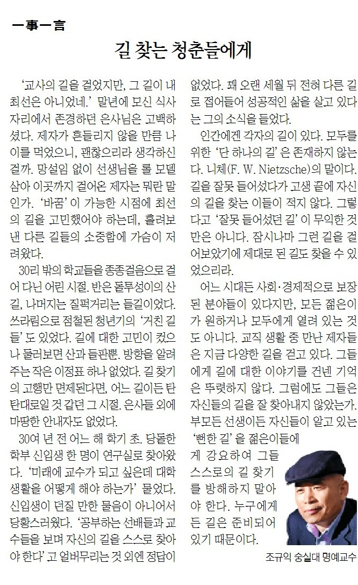

‘교사의 길을 걸었지만, 그 길이 내 최선은 아니었네.’ 말년에 모신 식사자리에서 존경하던 은사님은 고백하셨다. 제자가 흔들리지 않을 만큼 나이를 먹었으니, 괜찮으리라 생각하신 걸까. 망설임 없이 선생님을 롤모델 삼아 이곳까지 걸어온 제자는 뭐란 말인가. ‘바꿈’이 가능한 시점에 최선의 길을 고민했어야 하는데, 흘려보낸 다른 길들의 소중함에 가슴이 저려왔다.

​

30리 밖의 학교들을 종종걸음으로 걸어 다닌 어린 시절. 반은 돌투성이의 산길, 나머지는 질퍽거리는 들길이었다. 쓰라림으로 점철된 청년기의 ‘거친 길들’도 있었다. 길에 대한 고민이 컸으나 둘러보면 산과 들판 뿐. 방향을 알려주는 작은 이정표 하나 없었다. 길 찾기의 고행만 면제된다면, 어느 길이든 탄탄대로일 것 같던 그 시절. 은사들 외에 마땅한 안내자도 없었다.

​

30여 년 전 어느 해 학기 초. 당돌한 학부 신입생 한 명이 연구실로 찾아왔다. ‘미래에 교수가 되고 싶은데 대학생활을 어떻게 해야 하는가’ 물었다. 신입생이 던질 만한 물음이 아니어서 당황스러웠다. ‘공부하는 선배들과 교수들을 보며 자신의 길을 스스로 찾아야 한다’고 얼버무리는 것 외엔 정답이 없었다. 꽤 오랜 세월 뒤 전혀 다른 길로 접어들어 성공적인 삶을 살고 있다는 그의 소식을 들었다.

​

인간에겐 각자의 길이 있다. 모두를 위한 ‘단 하나의 길’은 존재하지 않는다. 니체(F.W.Nietzsche)의 말이다. 길을 잘못 들어섰다가 고생 끝에 자신의 길을 찾는 이들이 적지 않다. 그렇다고 ‘잘못 들어섰던 길’이 무익한 것만은 아니다. 잠시나마 그런 길을 걸어보았기에 제대로 된 길도 찾을 수 있었으리라. 어느 시대든 사회・경제적으로 보장된 분야들이 있다지만, 모든 젊은이들이 원하거나 모두에게 열려있는 것도 아니다. 교직 생활 중 만난 제자들은 지금 다양한 길을 걷고 있다. 그들에게 길에 대한 이야기를 건넨 기억은 뚜렷하지 않다. 그럼에도 그들은 자신들의 길을 잘 찾아내지 않았는가. 부모든 선생이든 자신들이 알고 있는 ‘뻔한 길’을 젊은이들에게 강요하여 그들 스스로의 길 찾기를 방해하지 말아야 한다. 누구에게든 길은 준비되어 있기 때문이다.

​