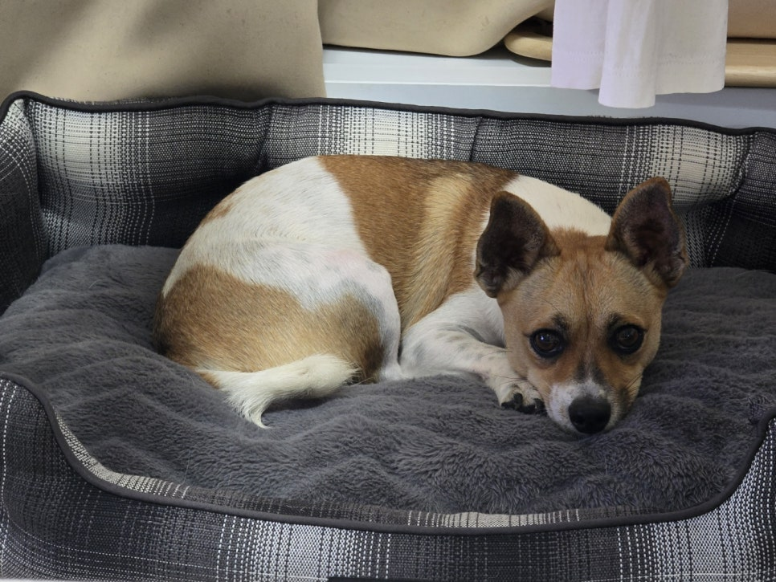
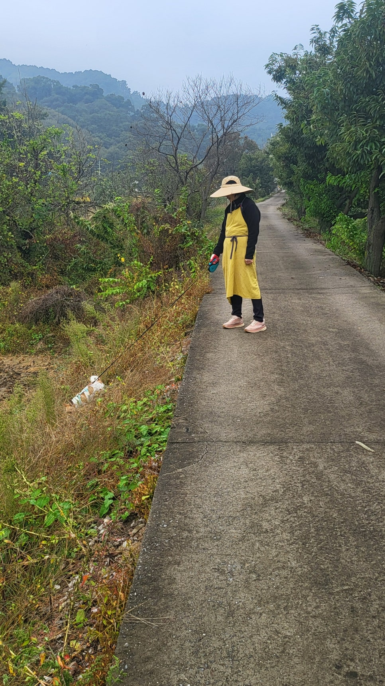

반려견 ‘초코’와 함께 돌아온 전원. 서울에서는 그와 함께 매일 아파트 주변을 산책했고, 전원에서는 냇가의 샛길을 즐겁게 걸었다. 그는 길가의 풀숲에 머리를 쳐 박고 스쳐간 동물들의 자취를 탐색하며 대소변도 자유롭게 해결하곤 했다. 초코 떠난 뒤 마을 강아지 한 마리를 입양하여 ‘후추’라는 이름을 붙여주었다. 밥・집・산책로 등을 떠나간 초코로부터 물려받은 그는 우리와 삶의 여건들을 공유하는 중이다.

후추와 산책할 때마다 동네 어른들을 만난다. 늘 ‘운동 가세요?’란 인사말을 건네는 그들. 그들 눈엔 사람만 보일 뿐 함께 걷는 개는 관심 밖이다. 우리의 명분은 ‘개 산책’이나, 이곳 어른들에겐 ‘사람 운동’이 우선이다. 늘 그런 인사말을 건네는 점에 의문을 갖고 이웃 개들을 관찰했다. 반 평 이내의 좁은 공간, 2m 내외의 짧은 목줄에 매여 지내는 참상이 보였다. 대부분 1년 동안 단 한 번도 주인과 산책하거나 잠시 풀려나는 자유도 누리지 못한 채 일생을 보내는 그들. 고령의 어른들이 개까지 끌고 다닐 수 없는 현실은 시골 개들에겐 일종의 불운이라 할 수 있을까. 개와 함께 걷는 우리에게 늘 ‘운동 가세요?’란 물음을 던지는 건 당연했다.

맛있는 음식이 많지만 사람들 때문에 도망하기 바빠 먹지 못하는 서울보다 음식은 보잘 것 없어도 마음 편히 먹을 수 있는 시골이 낫다는 동물우화가 ‘서울 쥐와 시골 쥐’ 이야기다. 그와 달리, 서울 개는 매일 산책하고 집 안에서 사람과 함께 편히 지내지만 시골 개는 늘 매여 있고 집 밖의 우리에 갇혀 지내며 먹이도 부실하니, 개에겐 서울이 낫다. 풍요는 허울뿐이고 마음도 불안한 서울 쥐와, 물질로는 초라하나 마음이 평안한 시골 쥐. 안락함과 풍요를 구가하는 서울 개와, 부자유와 빈곤에 고통당하는 시골 개. 서울과 시골의 입지나 처지에 따라 행・불행의 대비는 명료하고 정확하다.

세대 별 인구가 골고루 섞여 복잡하지만 문명의 혜택과 생활의 편의를 누리는 서울 사람들에 비해, 자유로이 나다닐 수도 없고 생활 편의 또한 부실한 전원 노인들의 처지는 그대로 ‘서울 개/시골 개’ 대비의 알레고리에 투영되어 있는 것 아닌가.

​

<https://www.chosun.com/culture-life/culture_general/2024/10/18/D2Z4VUY3U5ARRLB72ZZOIYYLJM/>

[**[일사일언] 서울 개와 시골 개**

일사일언 서울 개와 시골 개

www.chosun.com](https://www.chosun.com/culture-life/culture_general/2024/10/18/D2Z4VUY3U5ARRLB72ZZOIYYLJM/)

​