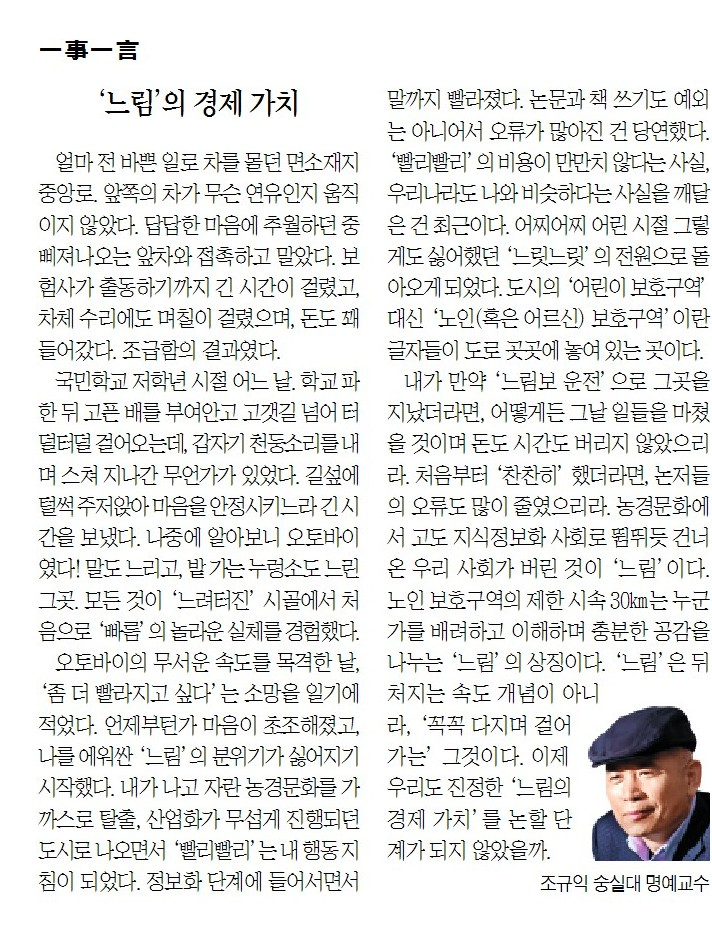

얼마 전, 바쁜 일로 차를 몰던 면소재지 중앙로. 앞쪽의 차가 무슨 연유인지 움직이지 않았다. 답답한 마음에 추월하던 중 삐져나오는 앞차와 접촉하고 말았다. 보험사가 출동하기까지 긴 시간이 걸렸고, 차체 수리에도 며칠이 걸렸으며, 돈도 꽤 들어갔다. 조급함의 결과였다.

​

국민학교 저학년 시절 어느 날. 학교 파한 뒤 고픈 배를 부여안고 고갯길 넘어 터덜터덜 걸어오는데, 갑자기 천둥소리를 내며 스쳐지나간 무언가가 있었다. 길섶에 털썩 주저앉아 마음을 안정시키느라 긴 시간을 보냈다. 나중에 알아보니 오토바이였다! 말도 느리고, 밭가는 누렁소도 느린 그곳. 모든 것이 ‘느려터진’ 시골에서 처음으로 '빠름'의 놀라운 실체를 경험했다.

​

오토바이의 무서운 속도를 목격한 날, ‘좀 더 빨라지고 싶다’는 소망을 일기에 적었다. 언제부턴가 마음이 초조해졌고, 나를 에워싼 ‘느림’의 분위기가 싫어지기 시작했다. 내가 나고 자란 농경문화를 가까스로 탈출, 산업화가 무섭게 진행되던 도시로 나오면서 ‘빨리빨리’는 내 행동지침이 되었다. 정보화 단계에 들어서면서 말까지 빨라졌다. 논문과 책 쓰기도 예외는 아니어서 오류가 많아진 건 당연했다. ‘빨리빨리’의 비용이 만만치 않다는 사실, 우리나라도 나와 비슷하다는 사실을 깨달은 건 최근이다. 어찌어찌 어린 시절 그렇게도 싫어했던 ‘느릿느릿’의 전원으로 돌아오게 되었다. 도시의 '어린이 보호구역' 대신 '노인(혹은 어르신) 보호구역'이란 글자들이 도로 곳곳에 누어있는 곳이다.

​

내가 만약 ‘느림보 운전’으로 그곳을 지났더라면, 어떻게든 그 날 일들을 마쳤을 것이며 돈도 시간도 버리지 않았으리라. 처음부터 ‘찬찬히’ 했더라면, 논저들의 오류도 많이 줄였으리라. 농경문화에서 고도지식정보화 사회로 뜀뛰듯 건너온 우리 사회가 버린 것이 ‘느림’이다. 노인보호구역의 제한 시속 30km는 누군가를 배려하고 이해하며 충분한 공감을 나누는 ‘느림’의 상징이다. ‘느림’은 뒤처지는 속도 개념이 아니라, ‘꼭꼭 다지며 걸어가는’ 그것이다. 이제 우리도 진정한 ‘느림의 경제 가치’를 논할 단계가 되지 않았을까.

<https://www.chosun.com/culture-life/culture_general/2024/10/25/ITMNB6NNCBDIRGD2XNS2AWPCJE/>

[**[일사일언] ‘느림’의 경제 가치**

일사일언 느림의 경제 가치

www.chosun.com](https://www.chosun.com/culture-life/culture_general/2024/10/25/ITMNB6NNCBDIRGD2XNS2AWPCJE/)

​