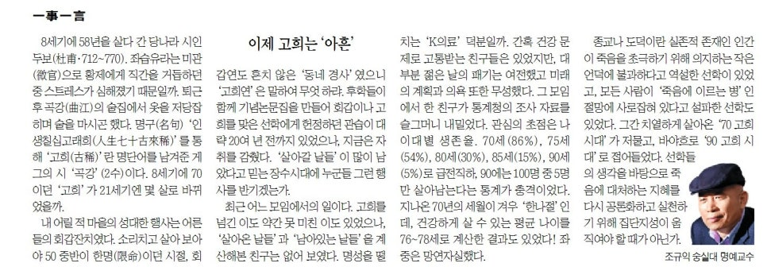

8세기에 58년을 살다 간 당나라 시인 두보(杜甫・712~770). 좌습유라는 미관(微官)으로 황제에게 직간을 거듭하던 중 스트레스가 심해졌기 때문일까. 퇴근 후 곡강(曲江)의 술집에서 옷을 저당 잡히며 술을 마시곤 했다. 명구(名句) ‘인생칠십고래희(人生七十古來稀)’를 통해 ‘고희(古稀)’란 명 단어를 남겨준 게 그의 시 ‘곡강’(2수)이다. 8세기에 70이던 ‘고희’가 21세기엔 몇 살로 바뀌었을까.

​

내 어릴 적 마을의 성대한 행사는 어른들의 회갑잔치였다. 소리 치고 살아보아야 50 중반이 한명(限命)이던 시절, 회갑연도 흔치 않은 ‘동네 경사’였으니 ‘고희연’은 말하여 무엇 하랴. 후학들이 함께 기념논문집을 만들어 회갑이나 고희를 맞은 선학에게 헌정하던 관습이 대략 20여 년 전까지 있었으나, 지금은 자취를 감췄다. ‘살아갈 날들’이 많이 남았다고 믿는 장수시대에 누군들 그런 행사를 반기겠는가.

​

최근 어느 모임에서의 일이다. 고희를 넘긴 이도 약간 못 미친 이도 있었으나, ‘살아온 날들’과 ‘남아있는 날들’을 계산해본 친구는 없어 보였다. 명성을 떨치는 ‘K-의료’ 덕분일까. 간혹 건강문제로 고통 받는 친구들은 있었지만, 대부분 젊은 날의 패기는 여전했고 미래의 계획과 의욕 또한 무성했다. 그 모임에서 한 친구가 통계청의 조사 자료를 슬그머니 내밀었다. 관심의 초점은 나이대별 생존율. 70세(86%), 75세(54%), 80세(30%), 85세(15%), 90세(5%)로 급전직하, 90에는 100명 중 5명만 살아남는다는 통계가 충격이었다. 지나온 70년의 세월이 겨우 ‘한나절’인데, 건강하게 살 수 있는 평균 나이를 76-78세로 계산한 결과도 있었다! 좌중은 망연자실했다.

​

종교나 도덕이란 실존적 존재인 인간이 죽음을 초극하기 위해 의지하는 작은 언덕에 불과하다고 역설한 선학이 있었고, 모든 사람이 ‘죽음에 이르는 병’인 절망에 사로잡혀 있다고 설파한 선학도 있었다. 그간 치열하게 살아온 ‘70 고희 시대’가 저물고, 바야흐로 ‘90 고희 시대’로 접어들었다. 선학들의 생각을 바탕으로 죽음에 대처하는 지혜를 다시 공론화하고 실천하기 위해 집단지성이 움직여야 할 때가 아닌가.

​

​

​

​

​

​

​