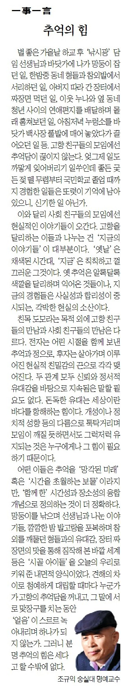

볕 좋은 가을날 하교 후 ‘낚시광’ 담임 선생님과 바닷가에 나가 망둥이 잡던 일, 한밤중 동네 형들과 참외밭에서 서리하던 일, 아버지 따라 간 장터에서 짜장면 먹던 일, 이웃 누나와 옆 동네 청년 사이의 연애편지들을 배달하며 몰래 훔쳐보던 일, 아침저녁 누렁소를 바닷가 백사장풀밭에 매어 놓았다가 끌어오던 일 등. 고향 친구들의 모임에선 추억담이 끊이지 않는다. 엊그제 일도 까맣게 잊어버리기 일쑤인데 좋든 궂든 젖 뗄 무렵부터 국민학교 졸업 때까지 경험한 일들은 또렷이 기억에 남아 있으니, 신기한 일 아닌가.

​

이와 달리 사회 친구들의 모임에선 현실적인 이야기들이 오간다. 고향을 달리하는 이들과 나누는 건 ‘지금의 이야기들’이 대부분이다. ‘옛날’은 채색된 시간대, ‘지금’은 칙칙하고 껄끄러운 그것이다. 옛 추억은 알록달록 색깔을 달리하며 익어온 것들이나, 지금의 경험들은 사실성과 합리성이 중시되는, 각박한 현실의 소산이다.

​

친목 도모라는 목적 외에 고향 친구들의 만남과 사회 친구들의 만남은 다르다. 전자는 어린 시절을 함께 보낸 추억과 정으로, 후자는 살아가며 이루어진 현실적 친밀감의 끈으로 각각 맺어진다. 두 관계 모두 신뢰와 정서적 유대감을 바탕으로 지속됨은 말할 필요도 없다. 돈독한 유대는 세상이란 바다를 항해하는 힘이다. 개성이나 정치적 성향 등의 다름으로 툭탁거리며 모임이 깨질 듯하면서도 그럭저럭 유지되는 것은 누구에게나 그 힘이 필요하기 때문이다.

어떤 이들은 추억을 ‘망각된 미래’ 혹은 ‘시간을 초월하는 보물’이라지만, ‘함께 한’ 시간성과 장소성의 융합 개념으로 정의하는 것이 더 정확하다. 망둥이를 낚으며 선생님과 나눈 이야기들, 깜깜한 밤 밭고랑을 포복하며 참외를 깨물던 형들과의 유대감, 장터 짜장면의 맛을 통해 짐작해본 바깥 세계 등은 ‘시골 아이들’을 오늘의 우리들로 키워 준 내면적 양식이었다. 견해의 차이로 첨예하게 대립할 때마다 누군가가 고향의 추억담을 꺼내고, 그 말에 서로 맞장구를 치는 동안 ‘얼음’이 스르르 녹아내리며 하나가 되지 않는가. 그러니 분명 추억의 힘은 세다고 할 수밖에 없다.

​

<https://www.chosun.com/culture-life/culture_general/2024/11/08/WQIDZ4NDZVGZDPHCK37KYVJ5UY/>

[**[일사일언] 추억의 힘**

일사일언 추억의 힘

www.chosun.com](https://www.chosun.com/culture-life/culture_general/2024/11/08/WQIDZ4NDZVGZDPHCK37KYVJ5UY/)

​