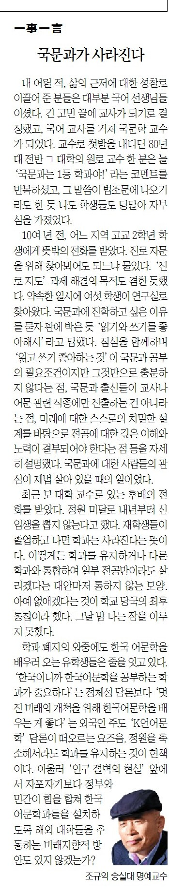

내 어릴 적, 삶의 근저에 대한 성찰로 이끌어준 분들은 대부분 국어선생님들이셨다. 긴 고민 끝에 교사가 되기로 결정했고, 국어교사를 거쳐 국문학 교수가 되었다. 교수로 첫 발을 내디딘 80년대 전반 **ㄱ** 대학의 원로교수 한 분은 늘 ‘국문과는 1등 학과야!’라는 멘트를 반복하셨고, 그 말씀이 법조문에 나오기라도 한 듯 나도 학생들도 덩달아 자부심을 가졌었다.

​

10여 년 전, 어느 지역 고교 2학년 학생으로부터 뜻밖의 전화를 받았다. 진로 자문을 위해 찾아뵈어도 되느냐 물었다. ‘진로지도’ 과제 해결의 목적도 겸한 듯 했다. 약속한 일시에 여섯 명의 학생들이 연구실로 찾아왔다. 국문과에 진학하고 싶은 이유를 묻자 판에 박은 듯 ‘읽기와 쓰기를 좋아해서’라고 답했다. 점심을 함께 하며 ‘읽고 쓰기 좋아하는 것’이 국문과 공부의 필요조건이지만 그것만으로 충분하지 않다는 점, 국문과 출신들이 교사나 어문 관련 직종에만 진출하는 건 아니라는 점, 미래에 대한 스스로의 치밀한 설계를 바탕으로 전공에 대한 깊은 이해와 노력이 결부되어야 한다는 점 등을 자세히 설명했다. 국문과에 대한 사람들의 관심이 제법 살아있을 때의 일이었다.

​

최근 모 대학 교수로 있는 후배의 전화를 받았다. 정원미달로 내년부터 신입생을 뽑지 않는다고 했다. 재학생들이 졸업하고 나면 학과는 사라진다는 뜻이다. 어떻게든 학과를 유지하거나 다른 학과와 통합하여 일부 전공만이라도 살리

겠다는 대안마저 통하지 않는 모양. 아예 없애겠다는 것이 학교 당국의 최후통첩이라 했다. 그날 밤 나는 잠을 이루

지 못했다.

​

학과 폐지의 와중에도 한국 어문학을 배우러 오는 유학생들은 줄을 잇고 있다. ‘한국이니까 한국어문학을 공부하는 학과가 중요하다’는 정체성 담론보다 ‘멋진 미래의 개척을 위해 한국어문학을 배우는 게 좋다’는 외국인 주도 ‘K-언어문학’ 담론이 떠오르는 요즈음. 정원을 축소해서라도 학과를 유지하는 것이 현책이다. 아울러 ‘인구절벽의 현실’ 앞에서 자포자기보다 정부와 민간이 힘을 합쳐 한국어문학과들을 설치하도록 해외 대학들을 추동하는 미래지향적 방안도 있지 않겠는가?

<https://www.chosun.com/culture-life/culture_general/2024/11/22/U3IHYUPTDFDFTOQR7U3W5HMZNM/>

[**[일사일언] 국문과가 사라진다**

일사일언 국문과가 사라진다

www.chosun.com](https://www.chosun.com/culture-life/culture_general/2024/11/22/U3IHYUPTDFDFTOQR7U3W5HMZNM/)

​