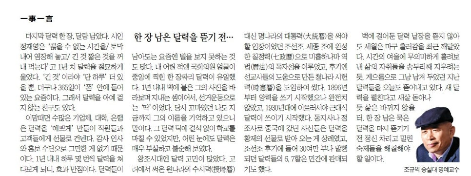
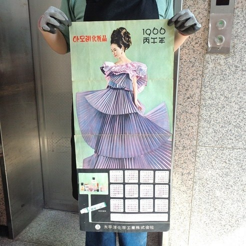
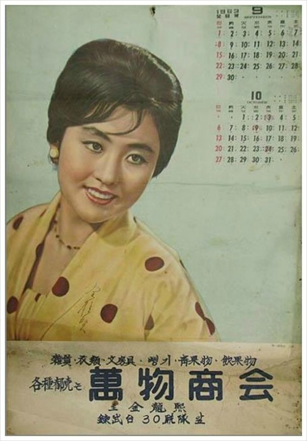
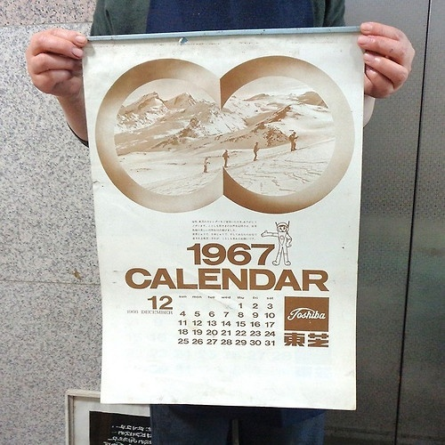

마지막 달력 한 장, 달랑 남았다. 시인 정재영은 ‘끊을 수 없는 시간을/토막 내어 염장해 놓고/긴 것 짧은 것을 꺼내 먹는다’고 1년 치 달력을 절묘하게 읊었다. ‘긴 것’이라야 ‘단 하루’ 더 있을 뿐. 더구나 365일이 ‘폰’ 안에 들어 있는 요즘이다. 그래서 달력을 아예 걸지 않는 친구도 있다.

​

이맘때면 수많은 기업체들, 대학들, 은행들은 달력을 ‘예쁘게’ 만들어 직원들과 고객들에게 선물로 건넨다. 감사인사와 홍보수단으로 그만한 게 없기 때문이다. 1년 내내 하루 몇 번씩 달력을 쳐다보게 되니, 효과 만점이다. 달력들이 남아도는 요즘엔 볕을 보지 못하는 것들도 많다. 내 어릴 적엔 국회의원 얼굴이 중앙에 찍힌 한 장짜리 달력이 유일했다. 1년 내내 벽에 붙은 그의 사진을 바라보며 지내는 셈이어서, 선거운동으로는 ‘딱’이었다. 당시 꼬마였던 나도 지금까지 그의 이름을 기억하고 있으니 말이다. 그 달력 덕에 결석 없이 학교를 마칠 수 있었지만, 어린 눈에도 달력은 매우 부실하고 불순해 보였다.

​

왕조시대엔 달력 고민이 많았다. 고려에서 써온 원나라의 수시력(授時曆) 대신 명나라의 대통력(大統曆)을 써야할 입장이었던 조선조. 세종 조에 완성한 칠정력(七政曆)으로 미흡하나마 역법(曆法)의 독자성을 이루었고, 후기엔 선교사들의 도움으로 만든 청나라 시헌력(時憲曆)을 도입하여 썼다. 1896년부터 양력을 쓰기 시작했으나 완전치 않았고, 1930년대에 이르러서야 근대식 달력이 쓰이기 시작했다. 동지사나 정조사로 중국에 갔던 사신들은 달력을 황제의 선물로 받아오는 게 상례였고, 조선조 후기에 들어 30여만 부나 발행되던 달력들의 6, 7할은 민간에 판매되기도 했다.

​

벽에 걸어둔 달력 낱장을 뜯지 않아도 세월은 마구 흘러감을 최근 깨달았다. 시간의 여울에 무의미하게 흘려보낸 삶의 자취들을 송두리째 지우려는 듯, 게으름으로 그냥 남겨 두었던 지난 달력들을 오늘도 뜯어내고 있다. 새 달력을 펼친다고 새 살 돋아나듯 삶은 바뀌지 않을 터. 한 장 남은 묵은 달력이 마저 뜯기기 전 정신 차리고 밀린 숙제들을 해결해야 할 일이다.

​