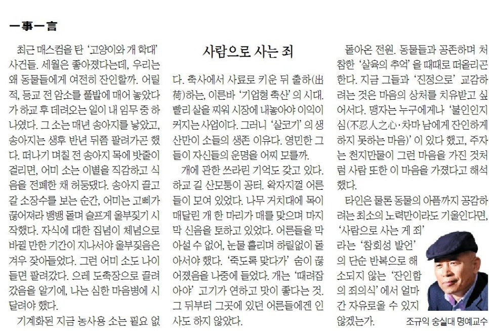

​

최근 뉴스를 탄 ‘고양이와 개 학대’ 사건들. 세월은 좋아졌다는데, 우리는 왜 동물들에게 여전히 잔인할까. 어릴 적, 등교 전 암소를 풀밭에 매어 놓았다가 하교 후 데려오는 일이 내 임무 중 하나였다. 그 소는 매년 송아지를 낳았고, 송아지는 생후 반년 뒤쯤 팔려가곤 했다. 떠나기 며칠 전 송아지 목에 밧줄이 걸리면, 어미 소는 이별을 직감하고 식음을 전폐한 채 허둥댔다. 송아지 끌고 갈 소장수를 보는 순간, 어미는 고삐가 끊어져라 뱅뱅 돌며 슬프게 울부짖기 시작했다. 자식에 대한 집념이 체념으로 바뀔 만한 기간이 지나서야 울부짖음은 겨우 잦아들었다. 그런 어미 소도 나이 들면 팔려갔다. 으레 도축장으로 끌려갔음을 알기에, 나는 심한 마음병에 시달려야 했다

.

기계화된 지금 농사용 소는 필요 없다. 축사에서 사료로 키운 뒤 출하(出荷)하는, 이른바 ‘기업형 축산’의 시대. 빨리 살을 찌워 시장에 내놓아야 이익이 커지는 사업이다. 그러니 ‘살코기’의 생산만이 소들의 생존 이유다. 영민한 그들이 자신들의 운명을 어찌 모를까.

​

개에 관한 쓰라린 기억도 갖고 있다. 하교 길 산모퉁이 공터. 왁자지껄 어른들이 모여 있었다. 나무 거치대에 목이 매달린 개 한 마리가 매를 맞으며 마지막 신음을 토하고 있었다. 어른들을 막아설 수 없어, 눈물 흘리며 하릴없이 돌아서야 했다. ‘죽도록 맞다가’ 숨이 끊어졌음을 나중에 들었다. 개는 ‘때려잡아야’ 고기가 연하고 맛이 좋다는 것. 그 뒤부터 그곳에 있던 어른들에겐 인사도 하지 않았다.

​

돌아온 전원. 동물들과 공존하며 처참한 ‘살육의 추억’을 때때로 떠올리곤 한다. 지금 그들과 ‘진정으로’ 교감하려는 것은 마음의 상처를 치유 받고 싶어서다. 맹자는 누구에게나 ‘불인인지심(不忍人之心・차마 남에게 잔인하게 하지 못하는 마음)’이 있다 했고, 주자는 천지만물이 그런 마음을 가진 것처럼 사람 또한 이 마음을 가졌다고 해석했다. 타인은 물론 동물의 아픔까지 공감하려는 최소의 노력만이라도 기울인다면, ‘사람으로 사는 게 죄’라는 ‘참회 성 발언’의

단순 반복으로 해소되지 않는 ‘잔인함의 죄의식’에서 얼마간 자유로울 수 있지 않겠는가.

<https://www.chosun.com/culture-life/culture_general/2024/12/13/43ROH2WCMNFBPGMK3YSKN2ICZA/>

[**[일사일언] 사람으로 사는 죄**

일사일언 사람으로 사는 죄

www.chosun.com](https://www.chosun.com/culture-life/culture_general/2024/12/13/43ROH2WCMNFBPGMK3YSKN2ICZA/)

​