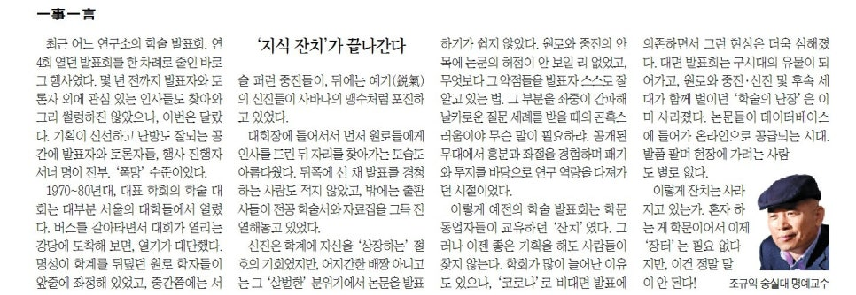

최근 어느 연구소의 학술발표회. 연 4회 열던 발표회를 한 차례로 줄인, 바로 그 행사였다. 몇 년 전까지 발표자와 토론자 외에 관심 있는 인사들도 찾아와 그리 썰렁하진 않았으나, 이번은 달랐다. 기획이 신선하고 난방도 ‘빵빵한’ 공간에 발표자와 토론자들, 행사 진행자 서너 명이 전부. ‘폭망’ 수준이었다.

1970-80년대, 대표학회의 학술대회는 대부분 서울의 대학들에서 열렸다. 버스를 갈아타면서 대회가 열리는 강당에 도착해보면, 열기가 대단했다. 명성이 학계를 뒤덮던 원로 학자들이 앞줄에 좌정해 있었고, 중간쯤에는 서슬 퍼런 중진들이, 뒤에는 예기(銳氣)의 신진들이 사바나의 맹수처럼 포진하고 있었다. 대회장에 들어서서 먼저 원로들에게 인사를 드린 뒤 자리를 찾아가는 모습도 아름다웠다. 뒤쪽에 선 채 발표를 경청하는 사람들도 적지 않았고, 밖에는 출판사들이 전공 학술서와 자료집들을 그득 진열해놓고 있었다.

​

신진의 경우 학계에 자신을 ‘상장하는’ 절호의 기회였지만, 어지간한 배짱 아니고는 그 ‘살벌한’ 분위기에서 논문을 발표하기가 쉽지 않았다. 원로와 중진의 안목에 논문의 허점이 안 보일 리 없었고, 무엇보다 그 약점들을 발표자 스스로 잘 알고 있는 법. 그 부분을 간파한 좌중으로부터 날카로운 질문세례를 받을 때의 곤혹스러움이야 무슨 말이 필요하랴. 공개된 무대에서 흥분과 좌절을 경험하며 패기와 투지를 바탕으로 연구역량을 다져가던 시절이었다.

​

이렇게 예전의 학술발표회는 학문 동업자들이 교유하던 ‘잔치’였다. 그러나 이젠 좋은 기획을 해도 사람들이 찾지 않는다. 학회가 많이 늘어난 이유도 있으나, ‘코로나’로 비대면 발표에 의존하면서 그런 현상은 더욱 심해졌다. 대면발표회는 구시대의 유물이 되어가고, 원로와 중진・신진 및 후속세대들이 함께 벌이던 ‘학술의 난장’은 이미 사라졌다. 논문들이 데이터베이스에 탑재되어 온라인으로 공급되는 시대. 발품 팔며 현장에 가려는 사람도 별로 없다. 이렇게 잔치는 사라지고 있는가. 혼자 하는 게 학문이어서 이제 ‘장터’는 필요 없다지만, 이건 정말 말이 안 된다!

<https://www.chosun.com/culture-life/culture_general/2024/12/27/LTOQEBQKO5A3XH2YCKYHYXRFCA/>

[**[일사일언] ‘지식 잔치’가 끝나간다**

일사일언 지식 잔치가 끝나간다

www.chosun.com](https://www.chosun.com/culture-life/culture_general/2024/12/27/LTOQEBQKO5A3XH2YCKYHYXRFCA/)

​