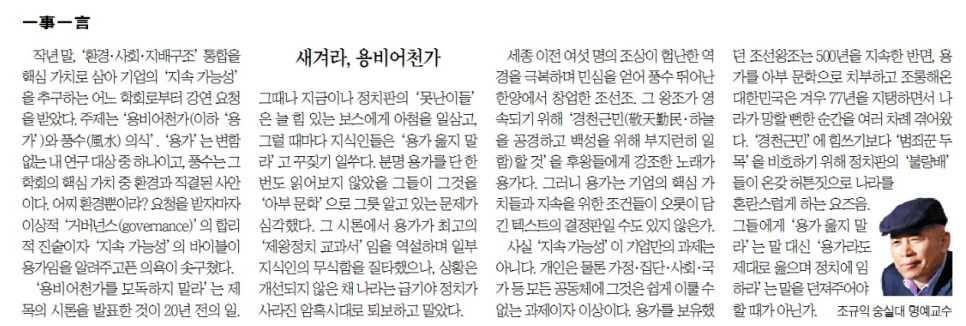

작년 말, ‘환경・사회・지배구조’ 통합을 핵심가치로 삼아 기업의 ‘지속가능성’을 추구하는 어느 학회로부터 강연 요청을 받았다. 주제는 ‘용비어천가(이하 ‘용가’)와 풍수(風水)의식’. ‘용가’는 변함없는 내 연구대상 중 하나이고, 풍수는 그 학회의 핵심가치 중 환경과 직결된 사안이다. 어찌 환경뿐이랴? 요청을 받자마자 이상적 ‘거버넌스(governance)’의 합리적 진술이자 ‘지속가능성’의 바이블이 용가임을 알려주고픈 의욕이 솟구쳤다.

‘용비어천가를 모독하지 말라’는 제목의 시론을 발표한 것이 20년 전의 일. 그 때나 지금이나 정치판의 ‘못난이들’은 늘 힘 있는 보스에게 아첨을 일삼고, 그럴 때마다 지식인들은 ‘용가 읊지 말라’고 꾸짖기 일쑤다. 분명 용가를 단 한 번도 읽어보지 않았을 그들이 그것을 ‘아부문학’으로 그릇 알고 있는 문제가 심각했다. 그 시론에서 용가가 최고의 ‘제왕정치 교과서’임을 역설하며 일부 지식인들의 무식함을 질타했으나, 상황은 개선되지 않은 채 나라는 급기야 정치가 사라진 암흑시대로 퇴보하고 말았다.

세종 이전 여섯 명의 조상들이 험난한 역경을 극복하며 민심을 얻어 풍수 뛰어난 한양에서 창업한 조선조. 그 왕조가 영속되기 위해 ‘경천근민(敬天勤民・하늘을 공경하고 백성을 위해 부지런히 일함)할 것’을 후왕들에게 강조한 노래가 용가다. 그러니 용가는 기업의 핵심가치들과 지속을 위한 조건들이 오롯이 담긴 텍스트의 결정판일 수도 있지 않은가.

사실 ‘지속가능성’이 기업만의 과제는 아니다. 개인은 물론 가정・집단・사회・국가 등 모든 공동체들에게 그것은 쉽게 이룰 수 없는 과제이자 이상이다. 용가를 보유했던 조선왕조는 500년을 지속한 반면, 용가를 아부문학으로 치부하고 조롱해온 대한민국은 겨우 77년을 지탱하면서 나라가 망할 뻔한 순간들을 여러 차례 겪어왔다. ‘경천근민’에 힘쓰기보다 ‘범죄꾼 두목’을 비호하기 위해 정치판의 ‘불량배’들이 온갖 허튼 짓으로 나라를 혼란스럽게 하는 요즈음. 그들에게 ‘용가 읊지 말라’는 말 대신 ‘용가라도 제대로 읊으며 정치에 임하라’는 말을 던져주어야 할 때가 아닌가.

<https://www.chosun.com/culture-life/culture_general/2025/01/03/XKHMVIN7QZC4DFQC2CD2C5EVLA/>4

[**[일사일언] 새겨라, 용비어천가**

일사일언 새겨라, 용비어천가

www.chosun.com](https://www.chosun.com/culture-life/culture_general/2025/01/03/XKHMVIN7QZC4DFQC2CD2C5EVLA/)

<https://www.chosun.com/site/data/html_dir/2003/09/29/2003092970285.html>

[**[시론] 용비어천가를 모독하지 말라**

시론 용비어천가를 모독하지 말라

www.chosun.com](https://www.chosun.com/site/data/html_dir/2003/09/29/2003092970285.html)

​