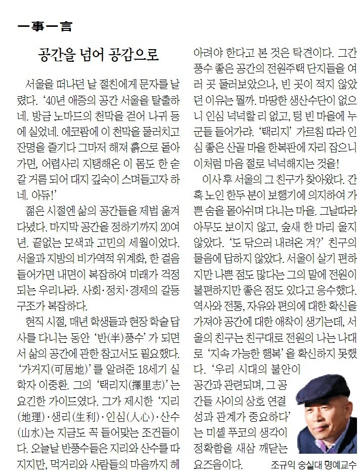

서울을 떠나던 날 절친에게 문자를 날렸다. ‘40년 애증의 공간 서울을 탈출하네. 방금 노마드의 천막을 걷어 나귀 등에 실었네. 에코팜에 이 천막을 둘러치고 잔명을 즐기다 그마저 해져 흙으로 돌아가면, 어렵사리 지탱해온 이 몸도 한 숟갈 거름 되어 대지 깊숙이 스며들고자 하네. 아듀!’.

​

젊은 시절엔 삶의 공간들을 제법 옮겨 다녔다. 마지막 공간을 정하기까지 20여 년. 끝없는 모색과 고민의 세월이었다. 서울과 지방의 비가역적 위계화, 한 걸음 들어가면 내면이 복잡하여 미래가 걱정되는 우리나라. 사회・정치・경제의 갈등구조가 복잡하다.

​

현직 시절, 매년 학생들과 현장 학술답사를 다니는 동안 ‘반풍수’가 되면서 삶의 공간에 관한 참고서도 필요했다. ‘가거지(可居地)’를 알려준 18세기 실학자 이중환. 그의 ‘택리지(擇里志)’는 요긴한 가이드였다. 그가 제시한 ‘지리(地理)・생리(生利)・인심(人心)・산수(山水)는 지금도 꼭 들어맞는 조건들이다. 오늘날 반풍수들은 지리와 산수를 따지지만, 먹거리와 사람들의 마음까지 헤아려야 한다고 본 것은 탁견이다. 그간 풍수 좋은 공간의 전원주택단지들을 여러 곳 둘러보았으나, 빈 곳이 적지 않았던 이유는 뭘까. 마땅한 생산수단이 없으니 인심 넉넉할 리 없고, 텅 빈 마을에 누군들 들어가랴. ‘택리지’ 가르침 따라 인심 좋은 산골마을 한 복판에 자리 잡으니 이처럼 마음 절로 넉넉해지는 것을!

​

이사 후 서울의 그 친구가 찾아왔다. 간혹 노인들 한 두 분이 보행기에 의지하여 가쁜 숨을 몰아쉬며 다니는 마을. 그날따라 아무도 보이지 않고, 숲새 한 마리 울지 않았다. ‘도 닦으러 내려온 겨?’ 친구의 물음에 답하지 않았다. 서울이 살기 편하지만 나쁜 점도 많다는 그의 말에 전원이 불편하지만 좋은 점도 있다고 응수했다. 역사와 전통, 자유와 편의에 대한 확신을 가져야 공간에 대한 애착이 생기는데, 서울의 친구는 친구대로 전원의 나는 나대로 ‘지속가능한 행복’을 확신하지 못했다. ‘우리 시대의 불안이 공간과 관련되며, 그 공간들 사이의 상호 연결성과 관계가 중요하다’는 미셸 푸코의 생각이 정확함을 새삼 깨닫는 요즈음이다.

<https://www.chosun.com/culture-life/culture_general/2025/01/10/TKRWFRJMWJHT5K3F5TQ6V2LF2U/>

[**[일사일언] 공간을 넘어 공감으로**

일사일언 공간을 넘어 공감으로

www.chosun.com](https://www.chosun.com/culture-life/culture_general/2025/01/10/TKRWFRJMWJHT5K3F5TQ6V2LF2U/)

​