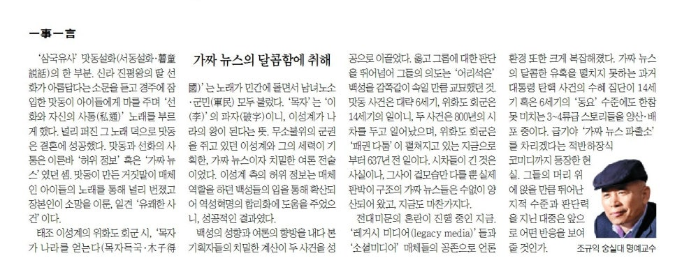

‘삼국유사’ 맛동설화(서동설화·薯童說話)의 한 부분. 신라 진평왕의 딸 선화가 아름답다는 소문을 듣고 경주에 잠입한 맛동이 아이들에게 마를 주며 ‘선화와 자신의 사통(私通)’ 노래를 부르게 했다. 널리 퍼진 그 노래 덕으로 맛동은 결혼에 성공했다. 맛동과 선화의 사통은 이른바 ‘허위 정보’ 혹은 ‘가짜 뉴스’였던 셈. 맛동이 만든 거짓말이 매체인 아이들의 노래를 통해 널리 번졌고 장본인이 소망을 이룬, 일견 ‘유쾌한 사건’이다.

​

태조 이성계의 위화도 회군 시, ‘목자가 나라를 얻는다(목자득국·木子得國)’는 노래가 민간에 돌면서 남녀노소·군민(軍民) 모두 불렀다. ‘목자’는 ‘이(李)’의 파자(破字)이니, 이성계가 나라의 왕이 된다는 뜻. 무소불위의 군권을 쥐고 있던 이성계와 그의 세력이 기획한, 가짜뉴스이자 치밀한 여론 전술이었다. 이성계 측의 허위정보는 매체 역할을 하던 백성들의 입을 통해 확산되어 역성혁명의 합리화에 도움을 주었으니, 성공적인 결과였다.

​

백성의 성향과 여론의 향방을 내다 본 기획자들의 치밀한 계산이 두 사건을 성공으로 이끌었다. 옳고 그름에 대한 판단을 뛰어넘어 그들의 의도는 ‘어리석은’ 백성을 감쪽같이 속일 만큼 교묘했던 것. 맛동 사건은 대략 6세기, 위화도 회군은 14세기의 일이니, 두 사건은 800년의 시차를 두고 일어났으며, 위화도 회군은 ‘패권다툼’이 펼쳐지고 있는 지금으로부터 637년 전 일이다. 시차들이 긴 것은 사실이나, 그 사이 겉모습만 다를 뿐 실제 판박이 구조의 가짜 뉴스들은 수 없이 양산되어 왔고, 지금도 마찬가지다.

​

전대미문의 혼란이 진행 중인 지금. ‘레거시 미디어(legacy media)’들과 ‘소셜미디어’ 매체들의 공존으로 언론환경 또한 크게 복잡해졌다. 가짜뉴스의 달콤한 유혹을 떨치지 못하는 과거 대통령 탄핵 사건의 수혜 집단이 14세기 혹은 6세기의 ‘동요’ 수준에도 한 참 못 미치는 3~4류급 스토리들을 양산·배포 중이다. 급기야 ‘가짜뉴스 파출소’를 차리겠다는 적반하장식 코미디까지 등장한 현실. 그들의 머리 위에 앉을 만큼 뛰어난 지적 수준과 판단력을 지닌 대중은 앞으로 어떤 반응을 보여줄 것인가.

<https://www.chosun.com/culture-life/culture_general/2025/01/17/5D3CIV6FA5B3NLMJFLIMRMTWOE/>

[**[일사일언] 가짜 뉴스의 달콤함에 취해**

일사일언 가짜 뉴스의 달콤함에 취해

www.chosun.com](https://www.chosun.com/culture-life/culture_general/2025/01/17/5D3CIV6FA5B3NLMJFLIMRMTWOE/)

​