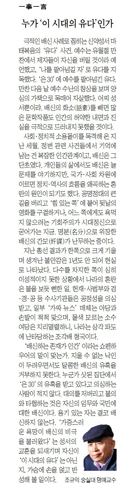

극적인 배신 사례로 꼽히는 신약성서 ‘마태복음’의 ‘유다’ 사건. 예수는 유월절 만찬에서 제자들이 자신을 버릴 것이라 예언했고, ‘자신을 팔아넘길 자’로 유다를 지목했다. ‘은 30’에 예수를 팔아넘긴 유다. 만찬 다음 날 예수 수난의 참상을 보며 양심의 가책으로 목매어 자살했다. 어찌 성서뿐이랴. 배신의 화소(話素)를 빼면 많은 문학작품들도 인간의 허약한 내면과 진실을 극적으로 드러내지 못했을 것이다.

​

사회・정치적 소용돌이들을 목격해온 지난 세월. 정변 관련 사건들에서 기억에 남는 건 복잡한 인간관계이고, 배신은 그 단초였다. 개인들의 삶에서도 배신은 늘 문제를 야기하지만, 국가・사회 차원에 이르면 정치・역사의 흐름을 왜곡하는 혼란의 원인이 되기도 했다. 언제나 기본적인 원칙과 대의에 따르라는 것이 국민의 뜻인데, 새삼 ‘배신’이란 말이 떠도는 이유는 뭘까. 공명정대의 큰 길을 버리고 ‘힘 있는 쪽’에 붙어 뒷날의 영화를 구걸하거나, 어느 쪽에게도 욕먹지 않으려는 기회주의가 시대정신으로 굳어가는 지금. 명분(名分)으로 위장한 배신의 간모(奸謀)들이 난무하는 중이다.

지난 총선 결과가 한 쪽으로 크게 기울며 생겨난 불안감은 1년도 안 되어 현실로 나타났다. 다수를 차지한 쪽이 심히 이성적이지 못한 상황에서 나라의 혼란은 불을 보듯 뻔한 일. 공정을 상실한 헌재・사법부와 검・경・공 등 수사기관들, 일부 ‘가짜뉴스’ 매체들은 야당과 손발이 척척 맞고, 물색 모르는 소수 여당은 지리멸렬하니, 나라는 삼각파도에 난타당하는 조각배 형국이다.

​

‘배신하는 존재가 인간’이라는 쇼펜하우어의 말이 맞는가. 지울 수 없는 낙인이 두려우면서도 달콤한 배신의 유혹을 거부하지 못한다. 누군가들이 삿된 집단으로부터 ‘은 30’의 유혹을 받고 있다고 의심하는 사람들이 적지 않다. 대의를 저버리고 불의와 타협하는 것은 자신의 임무와 국민에 대한 배신이다. 용기 있는 자는 결코 배신하지 않는다. ‘가증스런 욕망이 배신의 비극을 불러왔다’는 성서의 교훈을 되새기며 자신이 ‘이 시대의 유다’는 아닌지, 가슴에 손을 얹고 반성해볼 일이다.

<https://www.chosun.com/culture-life/culture_general/2025/01/24/EQLJBKDWW5EJ3F3MB7JVILB6ZA/>

[**[일사일언] 누가 ‘이 시대의 유다’인가**

일사일언 누가 이 시대의 유다인가

www.chosun.com](https://www.chosun.com/culture-life/culture_general/2025/01/24/EQLJBKDWW5EJ3F3MB7JVILB6ZA/)

​