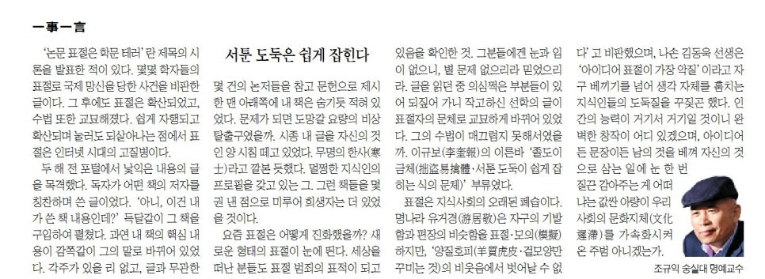

‘논문 표절은 학문테러’란 제목의 시론을 발표한 적이 있다. 몇몇 학자들의 표절로 국제망신을 당한 사건을 비판한 글이다. 그 후에도 표절은 확산되었고, 수법 또한 교묘해졌다. 쉽게 자행되고 확산되며 눌러도 되살아나는 점에서 표절은 인터넷 시대의 고질병이다.

​

두 해 전 포털에서 낯익은 내용의 글을 목격했다. 독자가 어떤 책의 저자를 칭찬하며 쓴 글이었다. ‘아니, 이건 내가 쓴 책 내용인데?’ 득달같이 그 책을 구입하여 펼쳤다. 과연 내 책의 핵심내용이 감쪽같이 그의 말로 바뀌어 있었다. 각주가 있을 리 없고, 글과 무관한 몇 건의 논저들을 참고문헌으로 제시한 맨 아래쪽에 내 책은 숨기듯 적혀 있었다. 문제가 되면 도망 갈 요량의 비상 탈출구였을까. 시종 내 글을 자신의 것인 양 시침 떼고 있었다. 무명의 한사(寒士)라고 깔본 듯했다. 멀쩡한 지식인의 프로필을 갖고 있는 그. 그런 책들을 몇 권 낸 점으로 미루어 희생자는 더 있었을 것이다.

​

요즘 표절은 어떻게 진화했을까? 새로운 형태의 표절이 눈에 띈다. 세상을 떠난 분들도 표절범죄의 표적이 되고 있음을 확인한 것. 그 분들에겐 눈과 입이 없으니, 별 문제 없으리라 믿었으리라. 글을 읽던 중 의심쩍은 부분들이 있어 되짚어 가니 작고하신 선학의 글이 표절자의 문체로 교묘하게 바뀌어 있었다. 그의 수법이 매끄럽지 못해서였을까. 이규보(李奎報)의 이른바 ‘졸도이금체(拙盜易擒體・서툰 도둑이 쉽게 잡히는 식의 문체)’ 부류였다.

​

표절은 지식사회의 오래된 폐습이다. 명나라 유거경(游居敬)은 자구의 기발함과 편장의 비슷함을 표절・모의(模擬)하지만, ‘양질호피(羊質虎皮・겉모양만 꾸미는 것)의 비웃음에서 벗어날 수 없다’고 비판했으며, 나손 김동욱 선생은 ‘아이디어 표절이 가장 악질’이라고 자구 베끼기를 넘어 생각 자체를 훔치는 지식인들의 도둑질을 꾸짖곤 했다. 인간의 능력이 거기서 거기일 것이니 완벽한 창작이 어디 있겠으며, 아이디어든 문장이든 남의 것을 베껴 자신의 것으로 삼는 일에 눈 한 번 질끈 감아주는 게 어떠냐는 값싼 아량이 우리 사회의 문화지체(文化遲滯)를 가속화시켜온 주범 아니겠는가.

​

​

<https://www.chosun.com/culture-life/culture_general/2025/01/31/AQQMXZY3HJF77BIILJREMYOZLA/>

[**[일사일언] 서툰 도둑은 쉽게 잡힌다**

일사일언 서툰 도둑은 쉽게 잡힌다

www.chosun.com](https://www.chosun.com/culture-life/culture_general/2025/01/31/AQQMXZY3HJF77BIILJREMYOZLA/)

​