태안 파도리를 아시지요? 전원주택을 짓고 살려면 이 정도는 되어야 한다고 큰 소리 칠만한 곳이지요. 그 바닷가 양지바른 언덕에 처소를 꾸리고 유유자적하시는 청운(靑雲) 김봉순(金奉淳) 선배의 처소에 현판을 걸어드리고 돌아왔습니다. 파도리의 빛나는 갯벌과 아름다운 물결, 그 속을 유영하는 망둥이・갯장어・간재미 등이 금방이라도 튀어 올라 잡혀 줄 것 같은 언덕 위의 아름다운 집과 현판 속의 당호가 어울려 기분이 좋은 하루였습니다.

​

‘헌(軒)’은 난간이나 큰 처마가 있는 집을 뜻하는 말입니다. 실례로 율곡 이이(李珥)가 태어난 집을 ‘오죽헌(烏竹軒)’이라 불렀고, 조선 시대 지방 관아에서 원님이 사무 처리하던 건물을 ‘동헌(東軒)’이라 불렀습니다.

​

전국의 고사(高士)와 벗들이 끊임없이 이 집을 찾아오는 것은 주인장 청운(靑雲) 선생의 소탈하고 격의 없는 인품에 감복하기 때문일 겁니다. 오늘까지 찾아와 자고 간 손님이 547명이라 합니다!

​

그런 점을 고려하여 저는 이 집을 ‘청빈지헌[請賓之軒/손님을 청하는 집]’이라 이름 짓고 심탄(心灘) 선생의 심안을 통해 전서[篆書/예서 이전에 있던 서체로 예술적 가치가 높은 아름다운 서체]로 바꾼 뒤 또 다른 장인(匠人)의 솜씨를 빌어 단단한 느티나무 원목에 새겼습니다. 현판을 걸며 부디 이 집의 정신이 자손만대 보존되길 기원합니다.

[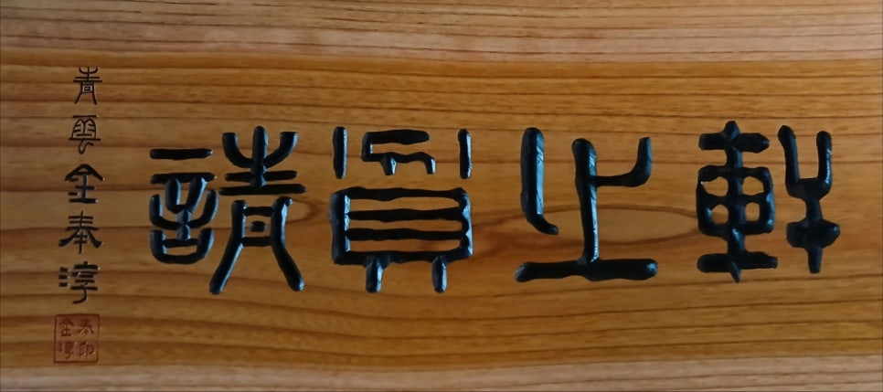](#)

[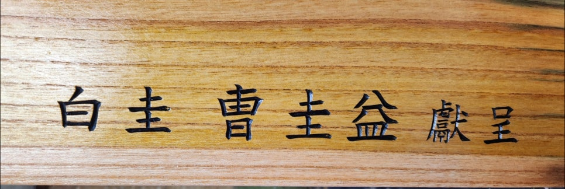](#)

[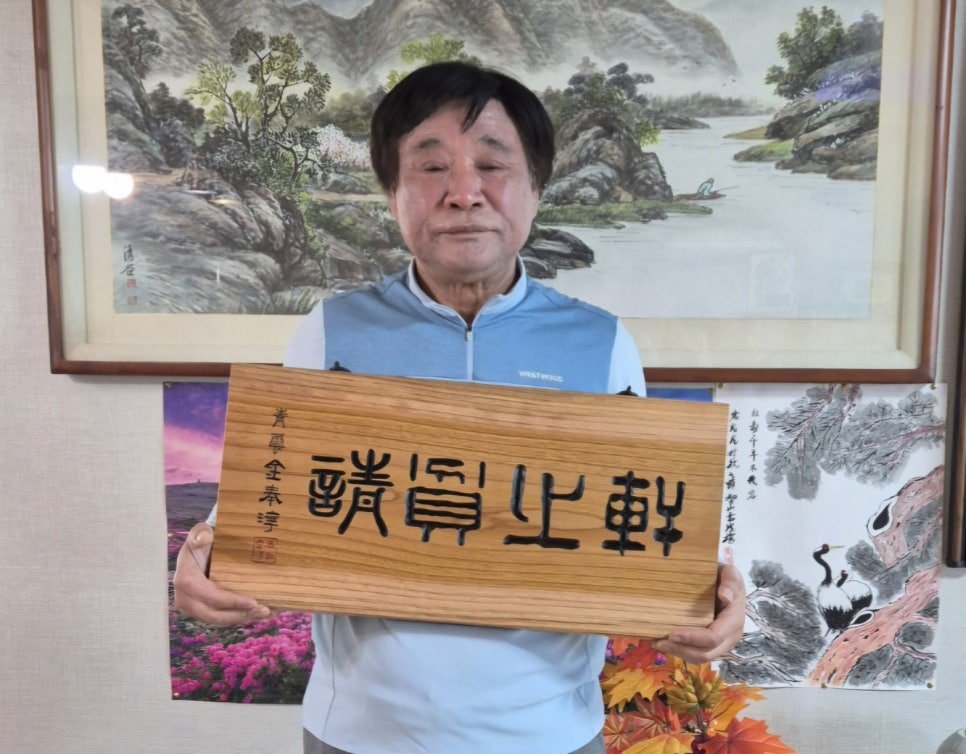](#)

[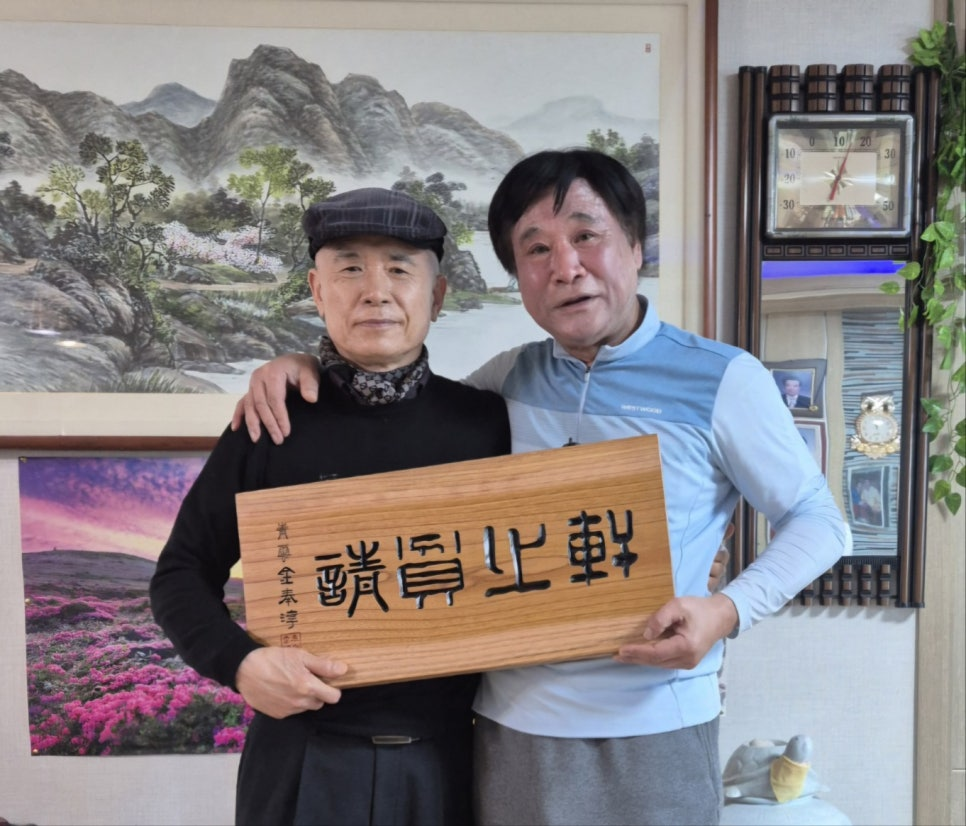](#)

[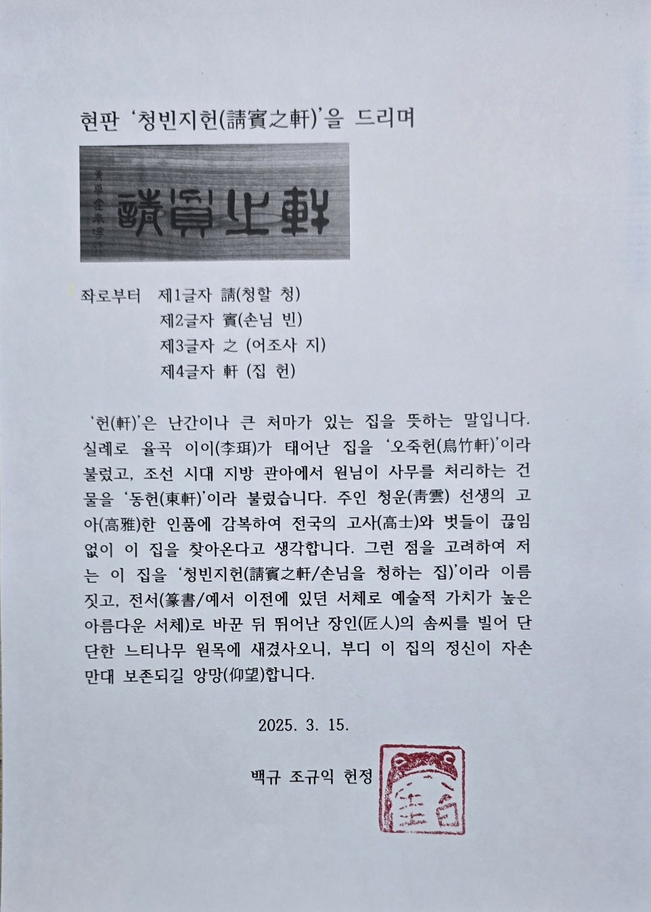](#)

[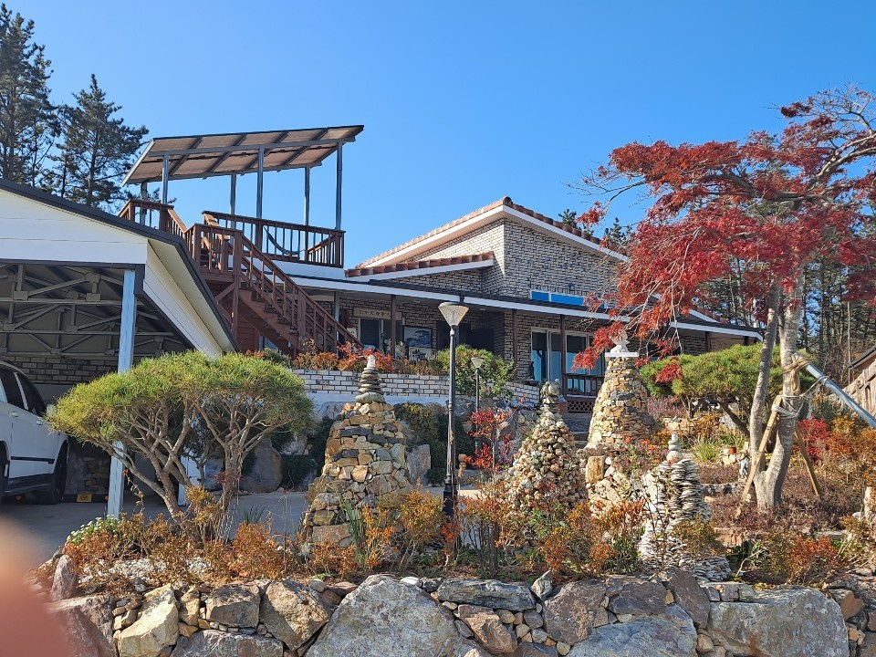](#)

[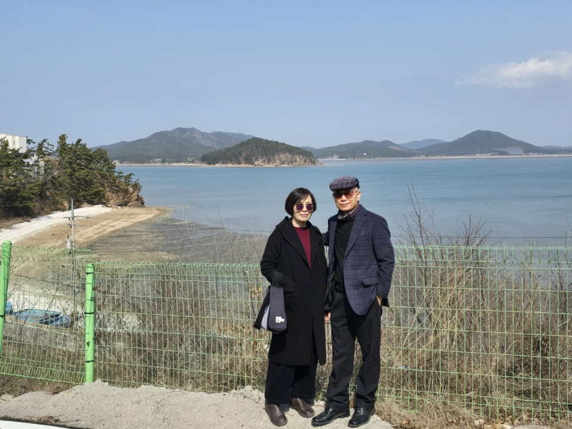](#)

[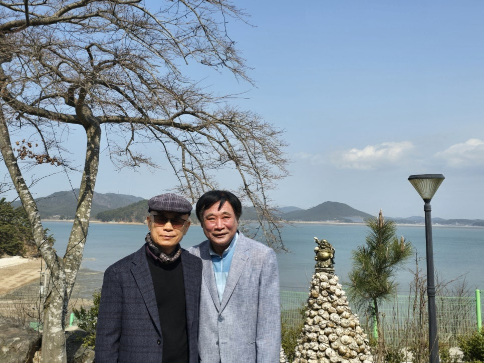](#)

[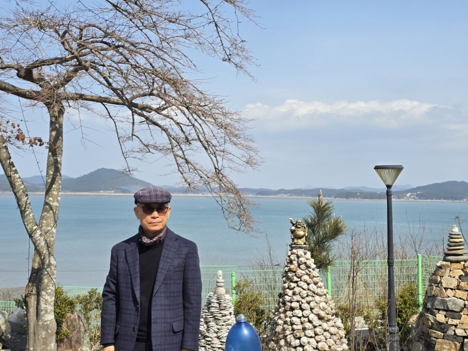](#)

[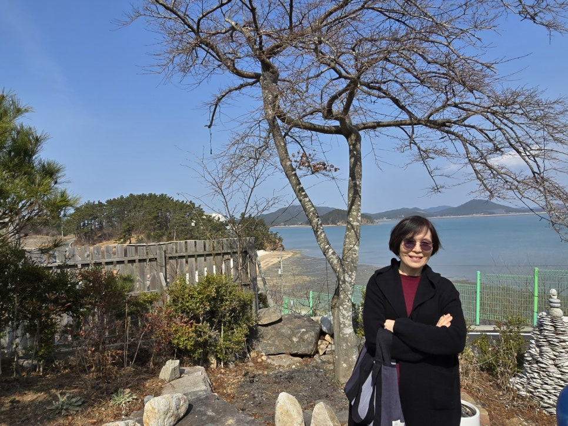](#)

[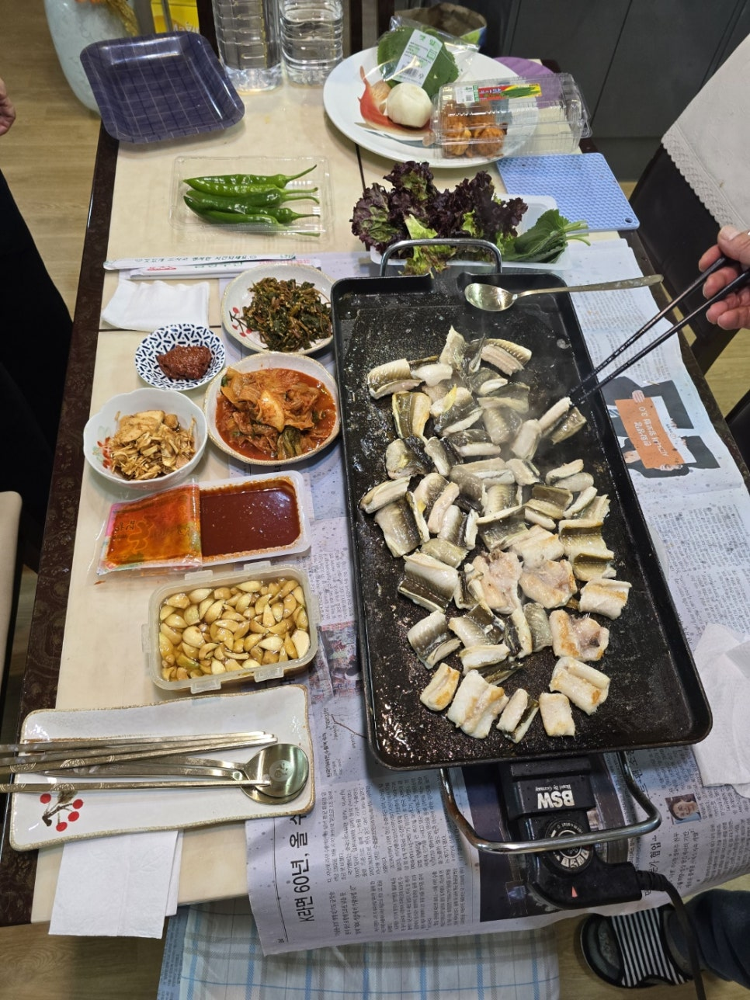](#)

[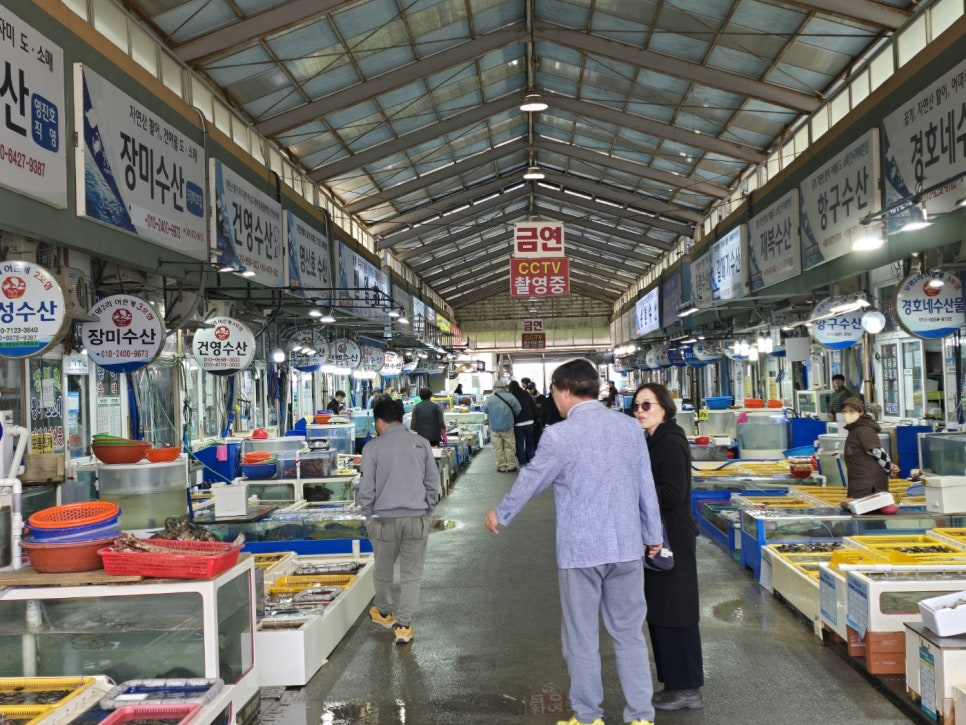](#)

​