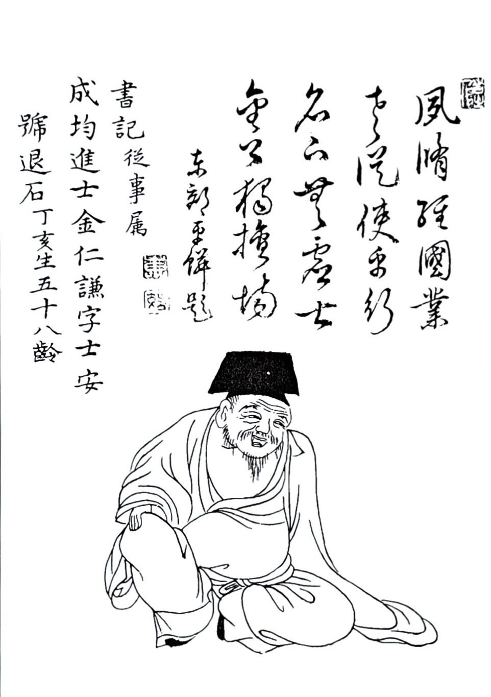
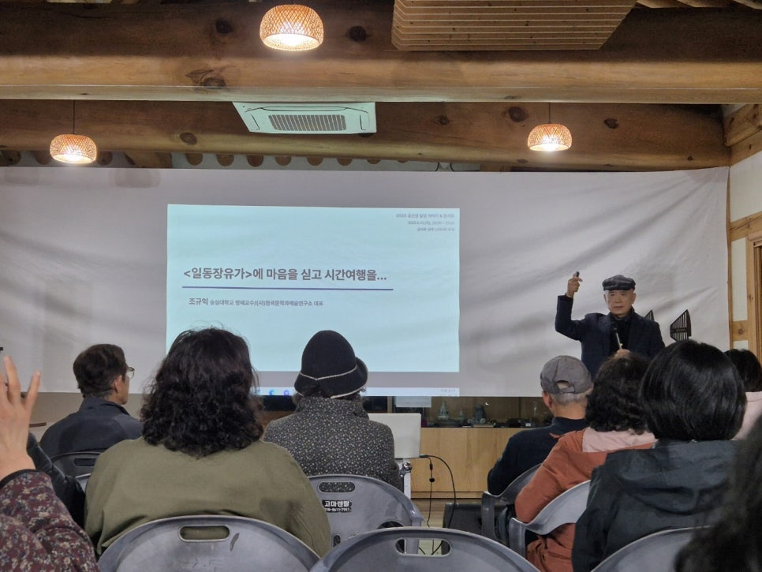
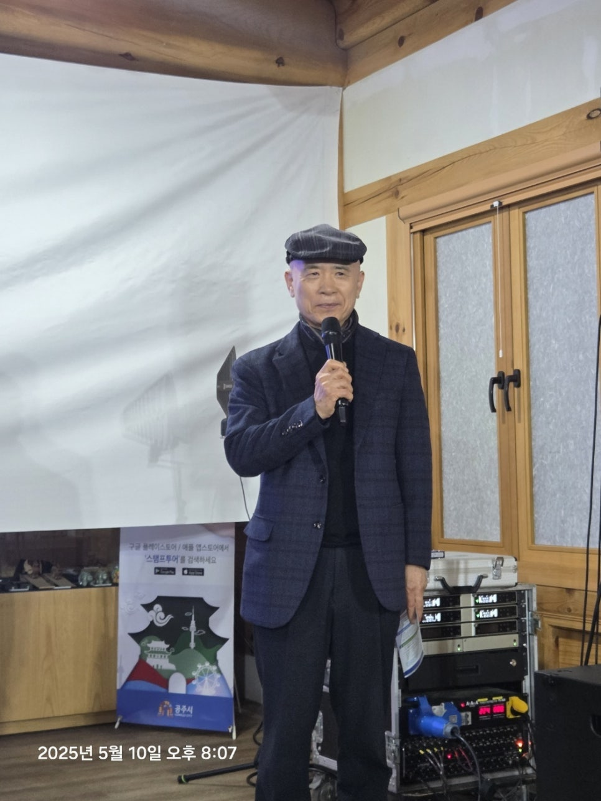
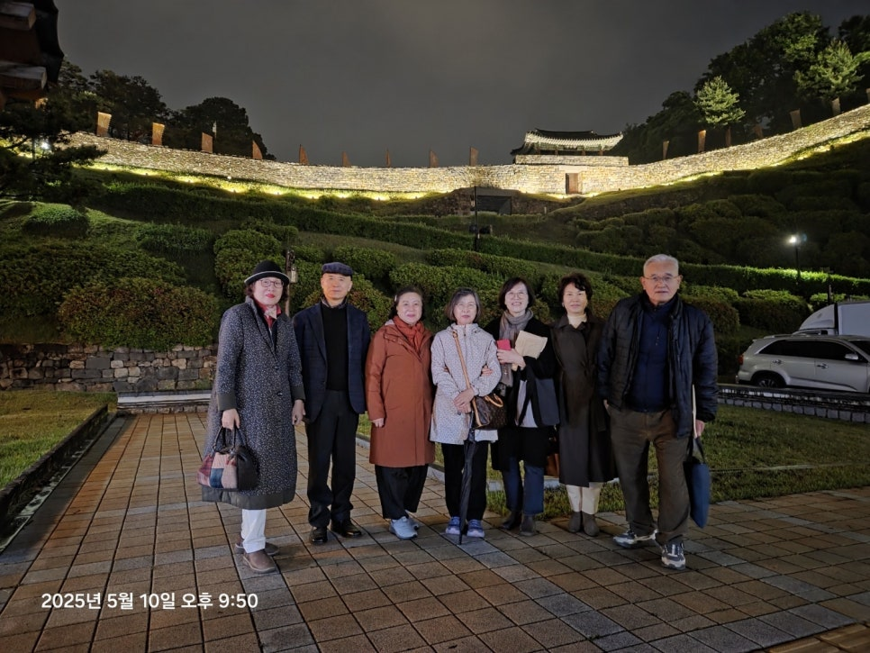
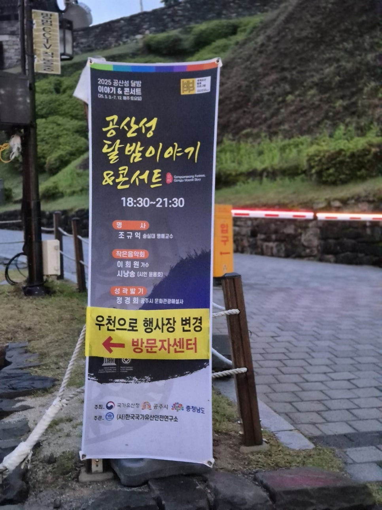

강연을 마치고

​

(사)한국국가유산안전연구소(소장 이태묵)가 주관하는 '공산성 달밤 이야기 & 콘서트'(2025년도 제2차)에서 '<일동장유가>에 마음을 싣고 시간여행을...'이란 제목의 강연을 무사히 마쳤습니다. 공주의 대표 지성들이 많이 와 주시어 더욱 빛나는 자리였으나, 시간 관계로 핵심적인 말씀들을 다 못드려서 아쉬웠습니다.

​

다만, '김인겸과 <일동장유가>를 보유한 역사문화도시 공주'라는 저 나름의 주장을 참석해주신 분들의 뇌리에 어느 정도 각인시켜드린 것 같아 약간 마음은 놓입니다.

​

무령왕에 이어 김인겸을 공주의 대표 인물로 좌정시키는 일은 이 도시가 지속적으로 발전할 수 있는 하나의 계기로 기능하리라 믿습니다. 현실적인 장벽들이 없진 않지만, 잘 되리라 믿습니다.

​

​