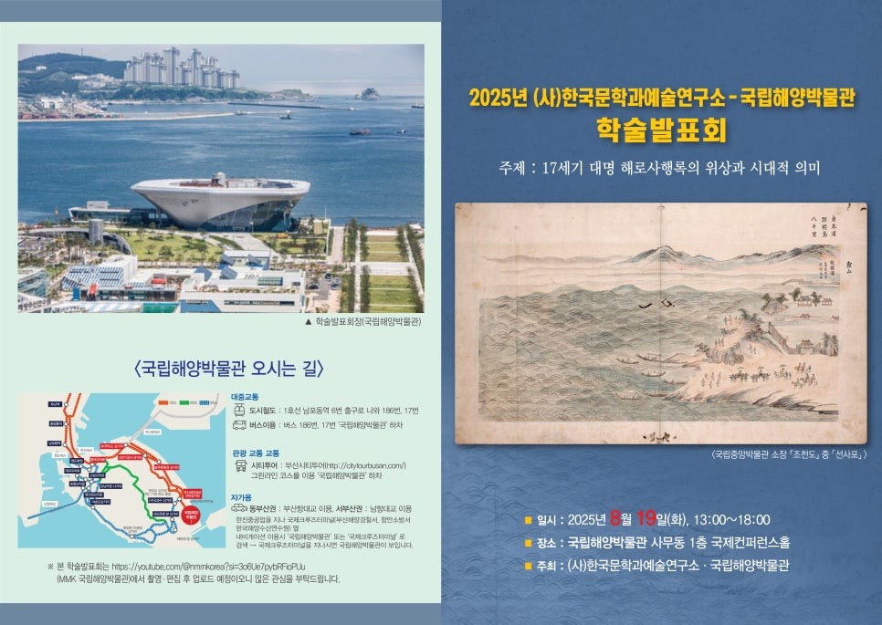
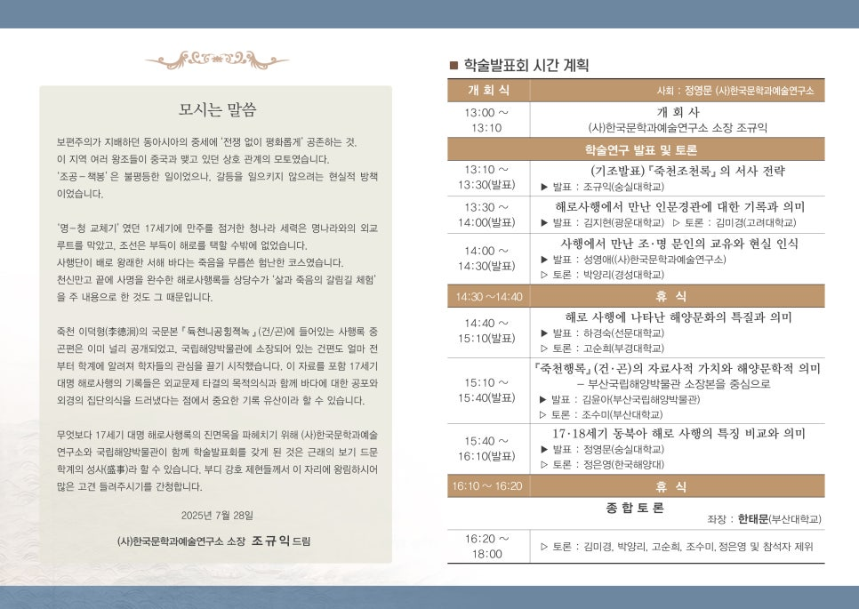

●주제: 17세기 대명해로사행록의 위상과 시대적 의미

●일시: 2025년 8월 19일(화) 13:00~18:00

●장소: 부산국립해양박물관 사무동 1층 국제컨퍼런스홀

●주최: (사)한국문학과예술연구소·국립해양박물관

​

사회: 정영문((사)한국문학과예술연구소)

​

13:00-13:10 개회사 (사)한국문학과예술연구소 소장 조규익

13:10-13:30 기조발표 : 조규익(숭실대)/<<죽천조천록>>의 서사 전략

13:30-14:00 발표: 김지현(광운대)/해로사행에서 만난 인문 경관에 대한 기록과 의미/토론:김미경(고려대)

14:00-1430 발표: 성영애((사)한국문학과예술연구소)/사행에서 만난 조·명 문인의 교유와 현실인식/토론: 박양리(경성대)

14:30-14:40 휴식

14:40-15:10 발표: 하경숙(선문대)/해로 사행에 나타난 해양문화의 특질과 의미/토론: 고순희(부경대)

15:10-15:40 발표: 김윤아(국립해양박물관)/<<죽천행록>>(건·곤)의 자료사적 가치와 해양문학적 의미-국립해양박물관 소장본을 중심으로/ 토론: 조수미(부산대)

15:40-1610 발표: 정영문(숭실대)/17·18세기 동북아 해로 사행의 특징 비교와 의미/토론: 정은영(한국해양대)

1610-1620 휴식

​

종합토론

좌장: 한태문(부산대)

16:20-18:00 토론: 김미경, 박양리, 고순희, 조수미, 정은영, 참석자 제위

​

​