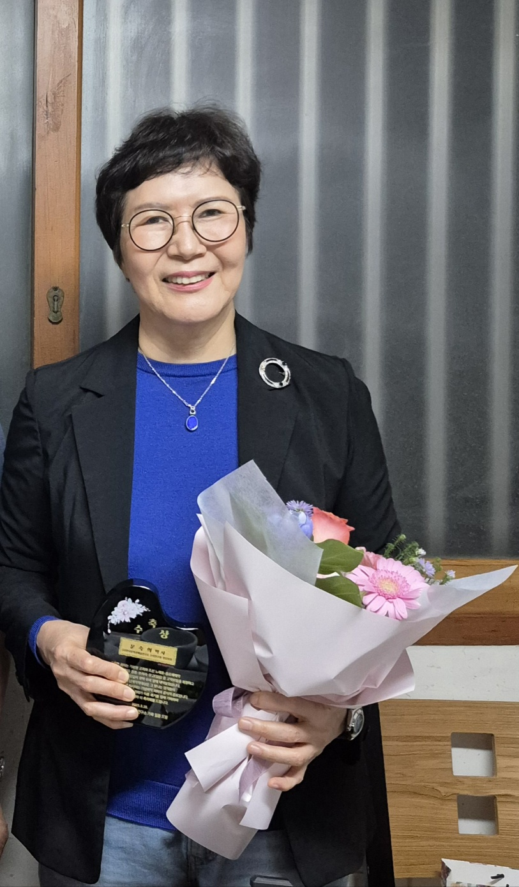
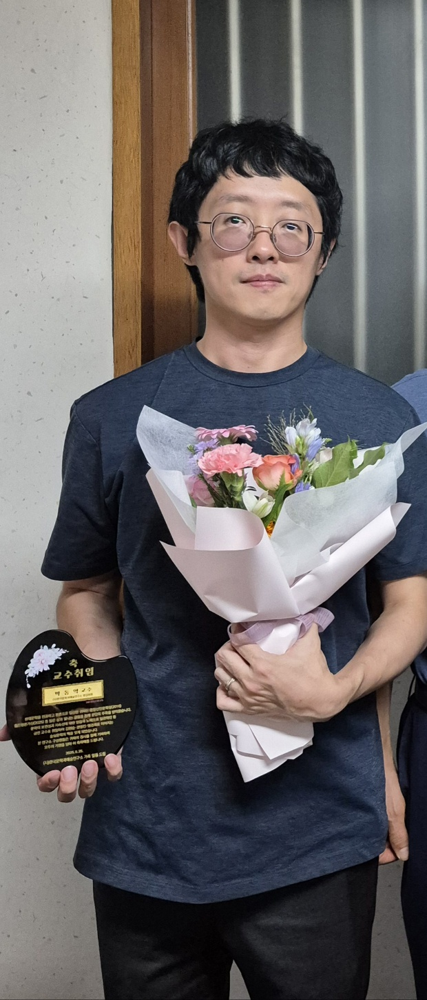
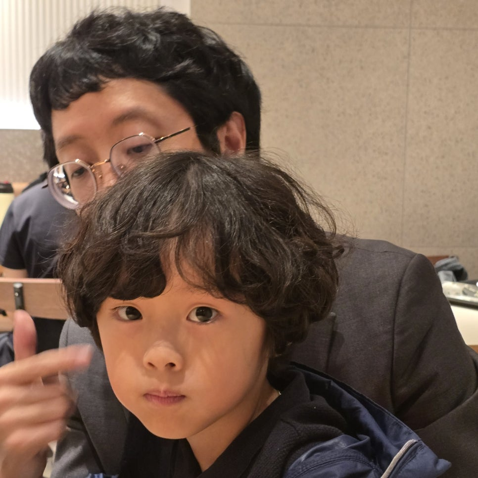
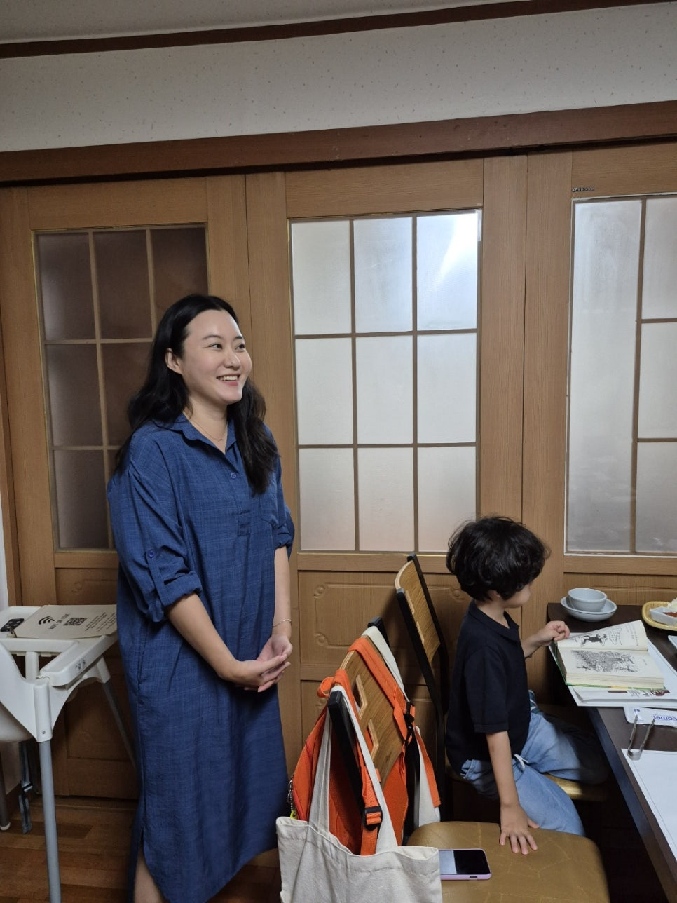
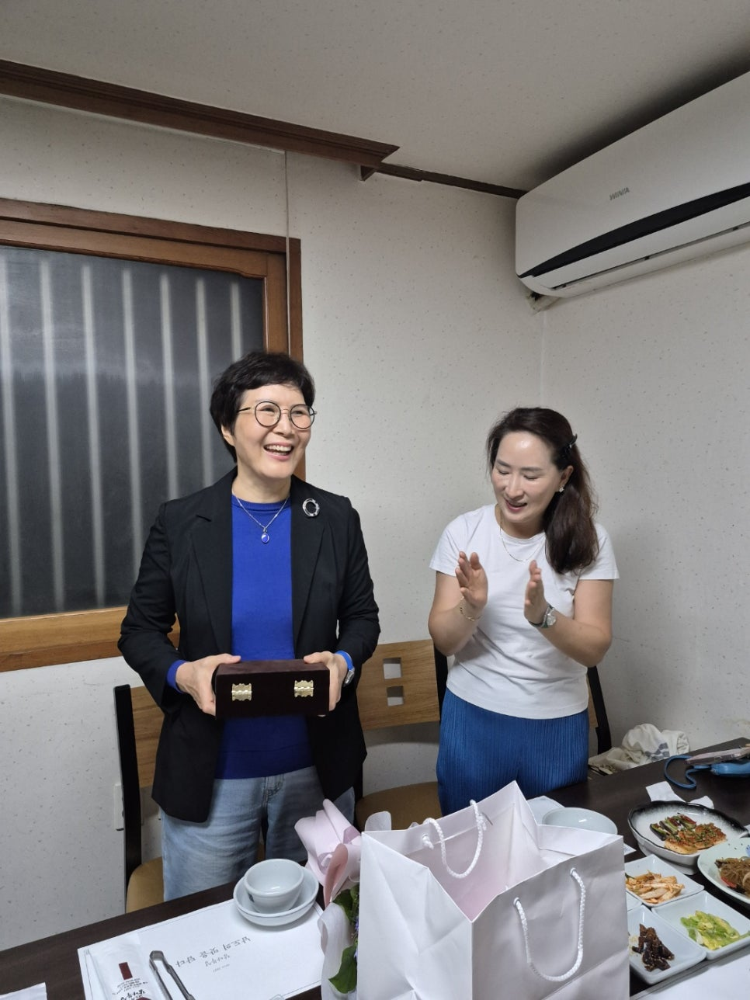
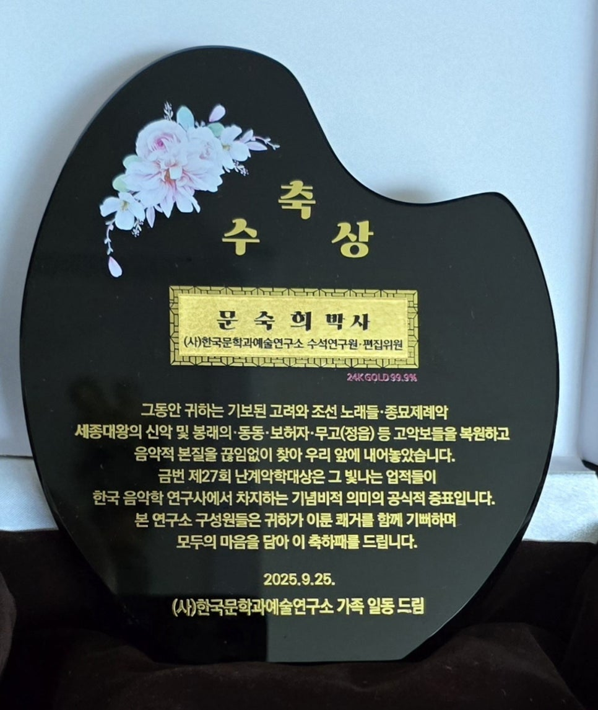
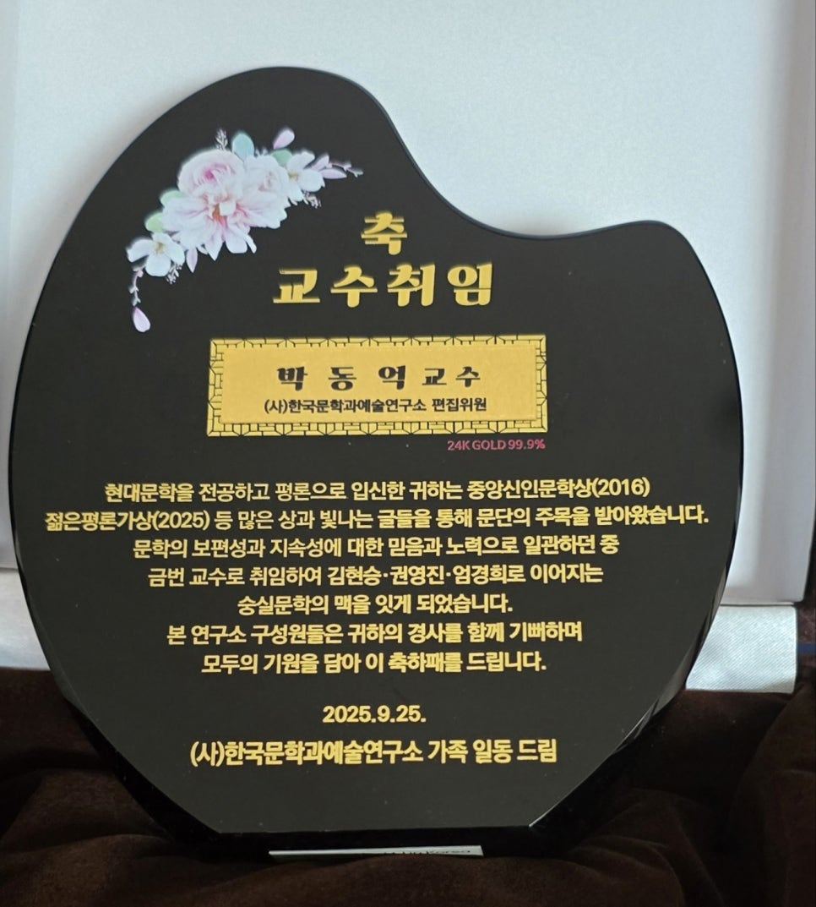

(사)한국문학과예술연구소에 겹경사가 생겼습니다. 수석연구원 겸 편집위원을 맡고 있는 문숙희 박사가 제 27회 난계악학대상을 받았고, 편집위원을 맡고 있는 박동억 박사가 숭실대 국어국문학과의 전임교수로 임용되었습니다.

​

한국음악 전공자 문 박사는 동동ㆍ무고(정읍)ㆍ종묘제례악ㆍ세종대왕의 신악 및 봉래의 등 고려ㆍ조선조 음악의 악보들을 복원하고 그 음악적 본질을 찾아내 수많은 논문과 책으로 출판하는 등 끊임없이 노력해왔습니다. 난계(蘭溪)는 조선조 악성(樂聖)으로 일컬어지는 박연(朴堧)입니다. 난계의 정신을 이어받아 한국음악학 분야의 발전을 위해 뛰어난 활동과 역할을 담당한 국악 연구자에게 수여하는 상이 난계악학대상입니다. 영광스런 상이지요.

​

현대문학을 전공하고 평론활동을 정력적으로 펼치고 있는 박 박사는 젊은평론가상(2005), 중앙신인문학상(2010) 등 빛나는 상들을 받았고, 많은 현장평론을 통해 문단의 주목을 받고 있는 젊은 평론가입니다. 이번에 숭실대 국문과 교수가 된 일은 김현승ㆍ권영진ㆍ엄경희로 이어지는 숭실문학의 맥을 잇게 되었다는 점에서 최고의 영예라 할 수 있습니다.

​

연구소 구성원들이 남도음식의 명가 '감나무집'에 모여 두 분의 쾌거를 축하했습니다. 두 분의 영광을 확대ㆍ발전시키기 위해 함께 노력하기로 다짐했습니다.

​

문숙희 박사

​

박동억 교수

박 교수와 아들 담우 군

박동억 교수 부인 김꽃지 선생과 열심히 책을 읽는 아들 담우 군

문숙희 박사와 축하해주는 윤아영 박사

​

​