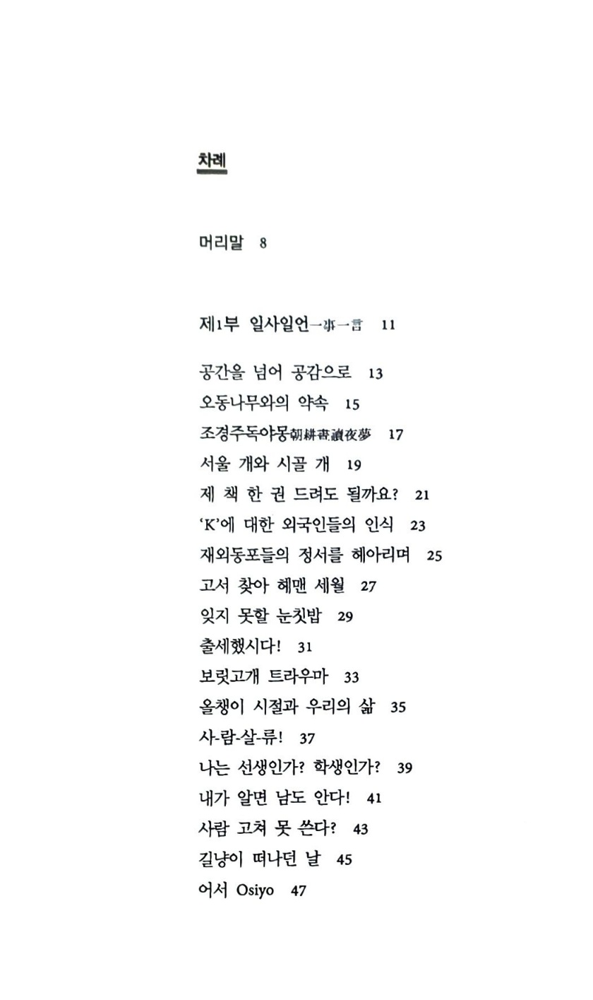
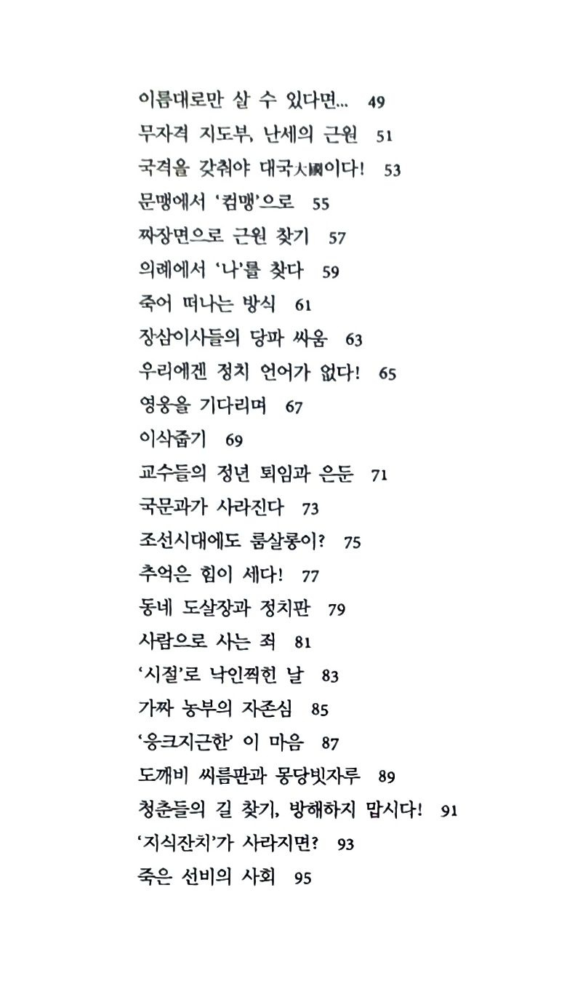
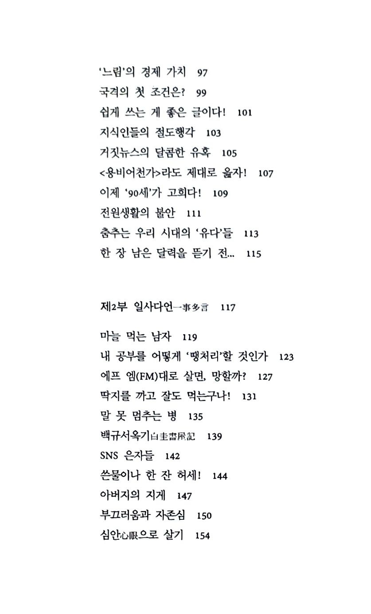
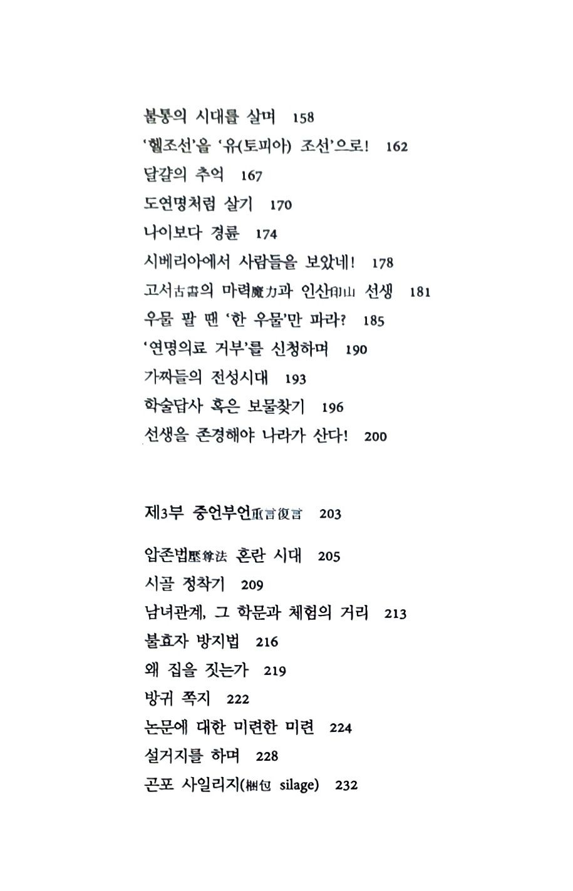
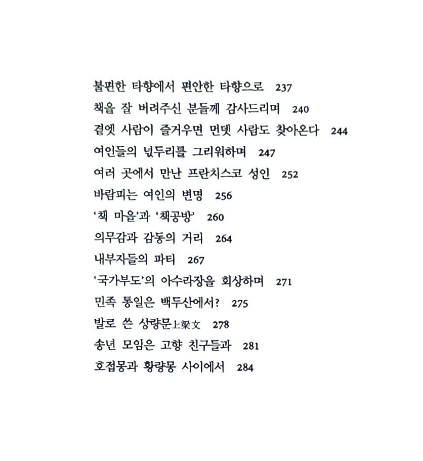

​

​

​

​

자유인 혹은 자연인의 공감과 소통

-조규익 수필집 <<오동나무와의 약속>>의 정신-

오래 전 <<꽁보리밥 만세>>(2000년 태학사)·<<어느 인문학도의 세상읽기>>(2009년 인터북스) 등의 수필집을 펴낸 국문학자 조규익 명예교수(숭실대)가 16년 만에 제3수필집 <<오동나무와의 약속>>(인터북스)을 출간했다. 그동안 간간이 발표했던 글들과 최근 새로 쓴 글들 가운데 98편을 골라 세 부분[1부: 일사일언(一事一言) 52편, 2부: 일사다언(一事多言) 23편, 3부: 중언부언(重言復言) 23편]으로 나누어 실었다. 간단명료한 서술과 묘사로 이루어진 짧은 글들이 제1부를, 부연(敷衍)과 첨언(添言)을 통해 주제의 본질을 비교적 상세히 제시한 글들이 제2부와 제3부를 각각 구성한다.

어린 시절의 ‘천방지축’도, 성장하며 어른들에게 부리던 ‘앙탈’도, 아내·자식·학생들에게 안겨준 마음의 상처도, 주변 사람들에게 바른말 퍼붓던 객기들도 글들의 곳곳에 드러나 있다. 멋진 친구들 틈에서 어렵게 지내온 자신의 과거를 감추려는 몸짓 또한 글들의 이면에 숨어 있다. 그러나 무엇보다 중요한 사실은 ‘자신이 자연 속의 한 존재임을 자각하는’ 생태 정신이 이 수필집을 관통한다는 점이다. 조 교수는 농촌의 때 묻지 않은 자연 속에서 태어나고 자란 베이비부머 세대의 일원이다. 십 대 중반 농촌을 떠나 대도시를 떠돌다가 40여 년 만에 다시 농촌으로 돌아와 자리 잡고 자연과 소통하며 자신의 내면을 관조하게 된 그는 농경시대와 산업화 시대의 갈등을 차원 높게 해소하는 데 성공한 것으로 보인다. 최근 그는 수필집을 소개하는 자리에서 그 점을 다음과 같이 설명했다.

“과거의 모든 것들이 부끄럽던 시절도 있었다. 성능 좋은 지우개가 있다면, 치기(稚氣) 만만했던 젊은 시절의 우행(愚行)이나 무거운 과거를 지우고 싶은 마음도 없지 않았다. 그러나 지금. 시간의 격랑에 휩쓸려간 ‘화양연화(花樣年華)’의 아련한 자취들을 바라보며, 통탄할 만큼 짧고 허무한 것이 인간의 삶임을 결국 깨닫고야 말았다. 내 삶을 책으로 엮고 보니, 지난날의 트라우마들이 ‘응어리’의 단단한 껍질을 깨고 추억으로 환생하여 가난한 나를 다독이는 형국이다. 결국 이렇게 되고야 말 것을 오랜 세월 허비하며 가까스로 여기까지 이르고 말았다.”

단순히 자연과 조 교수만의 약속으로 끝내려는 것이 이 책에 담긴 의도는 아니다. 독자들과 자연의 공감과 소통을 유도함으로써 우리의 삶을 한 차원 더 높은 생태의식으로 상승시키려는 것이 조 교수의 생각이다. 이와 관련, 그는 서문에서 다음과 같이 말했다.

“나는 에코팜의 일개 주민이다. 새 떼와 잡초들 사이에서 내 존재는 우월하지 않다. 그들이 나인지 내가 그들인지 구분할 수 없기 때문이다. 날아왔다 사라지곤 하는 새들, 자라나 꽃을 피우다가 모습을 감추곤 하는 잡초들. 그들과 나는 한 골짜기의 공기와 물을 공유한다. 한 생을 살아가는 참새나 잡초들도 나와 비슷한 추억 혹은 삶의 길이를 갖고 있으리라. 참새와 잡초들이 나를 에워싼 채 응원을 보내고 있다는 믿음. 수필이란 명목 아래 부끄럼 없이 옛날의 추억과 지금의 일들을 바탕으로 미래를 이야기하려는 이유도 바로 여기에 있다. 그래서 나는 자유인이다!”

자연과 소통하며 나눈 대화를 독자들에게 들려줌으로써 독자들도 자연과 공감하며 소통하리라 보는 것이 자유인 조 교수의 현실적 믿음이자 소망이다. ‘자유로운 자연인’과 ‘자연스런 자유인’은 수필을 통해 조 교수가 도달하고자 한 지선(至善)의 목표다. 그 목표를 위해 자연과의 소통, 독자와의 소통을 추구하는 것이 조 교수의 입장이다.

왜 수필을 쓰는가. 조 교수는 단순한 신변잡기(身邊雜記)가 수필의 본령(本領)이라고 보지 않는다. 신변의 일들 가운데 의미심장한 것들을 찾아내야 하고, 그것들을 잘게 부수어 새로운 의미들을 창조해야 한다고 믿기 때문이다. ‘분쇄 → 선광(選鑛) → 제련·정련’의 과정을 거쳐야 원석(原石)은 새로운 보석으로 태어나는 것 아니겠는가.