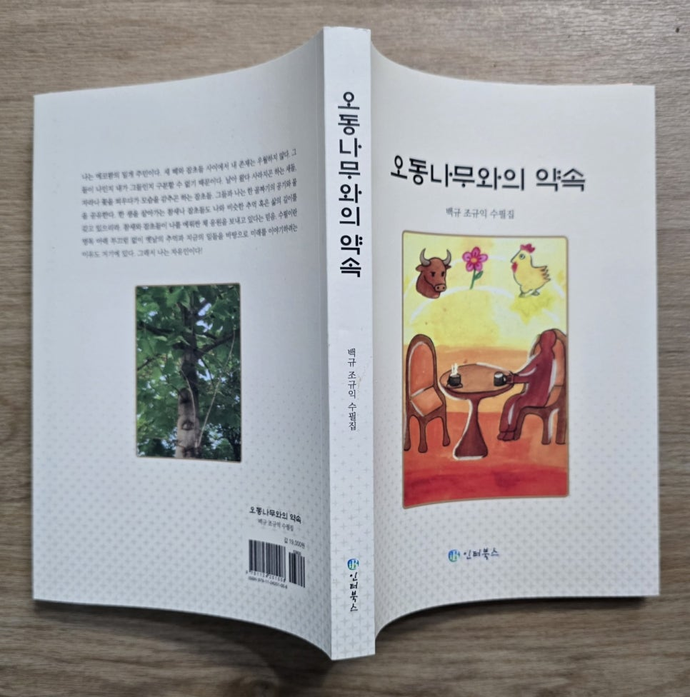

조웅선(대한민국 명장/기계기술사/공학박사)

​

​

친애하는 규익에게

<<오동나무와의 약속>> 잘 읽었네.

평생 국문학에 매진한 친구의 마음이 맑은 개울 속처럼 환히 들여다보이는 글이었네.

차제에, 한 시간 정도를 주마간산 격으로 훑었는데도 자네의 ‘응크지근’한 마음이 거의 읽혔다네. 뒤집어 말하면 자네의 의식과 무의식을 오가며 ‘응크지근’했던 것들의 정체를 잘 설명(소묘)한 글이라고 이해된다네. 결코 가볍잖은 주제들이 쉽게 읽혀서 단숨에 훑어졌는데, 순전히 자네가 글을 쉽게 쓴 탓이지, 내가 성의 없이 읽은 결과는 아님을 밝히네.

처음엔 귀거래사의 후반부가 그려졌는데, 점점 ‘응크지근한 것들에 대한 소묘’로 다가오면서, 내가 썼던 ‘건강검진후기’가 겹쳐 보였다네. 바꿔 말하면, 나 역시 ‘적잖게 응크지근’한 것투성이여서 그 응크지근한 것들을 어떻게든 해소하지 않으면 점점 더 응크지근해질 것에 대한 처방으로서의 글쓰기였달까? 그런데 나만 느끼는 자네와의 묘한 동질감이랄까?

나는 끝말을 “어디로 가고 있을까?”라고 했는데, 규익은 “호접몽과 황량몽 사이에서”라고 정리를 했군?

차제에, 내가 작년에 출판했던 동기와 목적 및 경위를 설명하려네.

2019년 9월 점멸신호 좌회전을 하면서 버스전용차선 화단형 도로 분리대를 중앙선으로 착각하여 전용차선을 달리던 버스를 들이받았는데, 내가 탄 경차(모닝)의 시트 고정 볼트가 끊겨 나갔을 정도의 충격이었고, 충돌 위치로 보아 내가 0.5초만 빨리 갔다면 즉사했을 터였다네.

요행히도 몇 군데 찰과상과 목과 허리의 충격으로 입원했는데, 그날 저녁 문득 인생이 덧없다는 생각이 들었네. 즉, ‘0.5초 사이에 이승과 저승이 갈리는 삶이 그 무슨 의미가 있나? 준비조차 없는 죽음? 그런데, 내 삶의 목표가 있었으며, 내 정체성은 무엇이었던가?’ 따위의 생각이 들면서, 덧없는 인생이라는 허무한 마음이 짙어지며 퍽 우울해졌다네.

그때까지 나는 외롭다거나 우울하다거나 사는 게 힘들다거나 불행하다는 생각은 없었다네. 물론 어린 시절엔 부러운 것들도 있었지만, 군에 입대 전까지 철학적인 독서에 심취하여 섣부르고 서툴지언정 늘 행복했었기에, 교통사고 이후 겪는 우울감이 아주 생경하여 부담스러웠다네.

게다가 마침 입원 기간이 조국 장관 지명자 청문회였고, 나는 그때까지 정치에 크게 관심이 없었는데, 같은 병실에 있는 분들이 계속 켜놓은 TV를 보다가 문득 '와! 내가 엄청 어리숙하게 살았네!' 싶은 생각이 들면서, 어렴풋한 모욕감과 분노와 우울감 따위가 뒤엉키더니, 머리가 띵하며 생각의 갈피가 확 헝클어져 머릿속이 하얘지면서 멍한 상태가 계속되었다네.

퇴원 이후로도 내가 퍽 어리숙하다는 자괴감과 우울감이 이어져서 내가 왜 이러나를 알아보려고 나 자신을 돌아보니, 어려서부터 부모님으로부터 정직하고 착하게 살라는 가르침은 물론 동화나 소설을 읽어도 온통 권선징악의 귀결이라서, 당연히 정직하고 선하게 살면서 여태껏 긍정적인 평가를 받으며 살았는데, 세상엔 나와 반대의 생각과 방식으로 사는 사람도 많다는 사실 앞에서 <내가 참으로 어리숙했음을 확인하고, 그 어리숙한 나를 인정해야 하는 자괴감의 충격> 때문이라고 정리되었다네.

또 일종의 막연한 모욕감과 분노와 반발감이 일었는데, 청문회 전에 장관 후보로 거론되던 조국이 방송에서 "나는 사회주의자다! 사회주의가 왜 나쁘냐?."라고 말했던 모습이 청문회장에서 까발려지는 조국이 내면과 클로즈업되었기 때문이었네. 그런 조국과 그를 두둔하는 사람들에게 나는 이렇게 말하고 싶었으리. "그래! 내가 어리숙한 것은 인정한다! 그러나 나는 이익을 구하려고 겉과 속을 다르게 꾸미지 않았다. 그러니 행여라도 정직한 우리를 완전 숙맥이라 여기지는 말아다오! 너희는 정직한 사람들을 숙맥이라고 여겼기에 숭고한 사회주의자를 자처하면서 천박한 짓으로 정직하고 선한 사람들을 기만했고, 그 민낯이 까발려진 뒤에도 그토록 뻔뻔한 거야! 그런 너희 때문에 나라가 두 토막 나서 후세에게 정의롭게 살자는 말은 고사하고 후세와 더불어 정의의 갈피를 논하고 구할 수도 없거니와, 정의가 어느새 다수결로 쟁취한 승자독식의 추한 전리품으로 전락해 버린 거야!”라는 반증으로 그들이 안긴 나의 자괴감을 회복하겠다는 반발감이었네.

퇴원한 이후에도 교통사고로 인한 뜻밖의 ‘인생무상’과 청문회 쇼크로 우울감이 지속돼서 틈틈이 마음을 헤치고 들여다보기를 5년여, 마침내 헝클어졌던 맘의 갈피가 잡혔는데, 생뚱맞게도 ‘이 일그러진 정치와 종교 때문에 나처럼 우울감 느끼는 분들께 위로가 되잖을까? 그러려면 출판해야잖아?’ 싶어졌네. 또 한편으론 내 아이들에게 사진 몇 장이 아닌 한 권의 책을 남겨놓고 싶다는 생각도 추동력이었네. 막상 출판하려니 문학 문외한으로서 제목도, 형식도, 표현 한계도(명예훼손 소송 따위의 빌미), 언급할 범주도 난감해서 포기하고 싶었지만, “활자의 요건일 보편적 가치(작품성)를 떠나 심하게 흔들렸던 나 자신을 가다듬어 갱신하는 진행형으로서의 담담한 발자취 기록이었다.”라고 정리하게 된 것이네.

허나!

모든 일에는 타이밍이 중요한 것을 나는 출판 몇 개월 후에야 깨달았다네!

그놈의 한강만 아니었으면 내 <건강검진 후기>가 대박쳤을 수도 있었다는...

그래서 씁쓸한데, 언제 <쓴물> 한잔하세나...