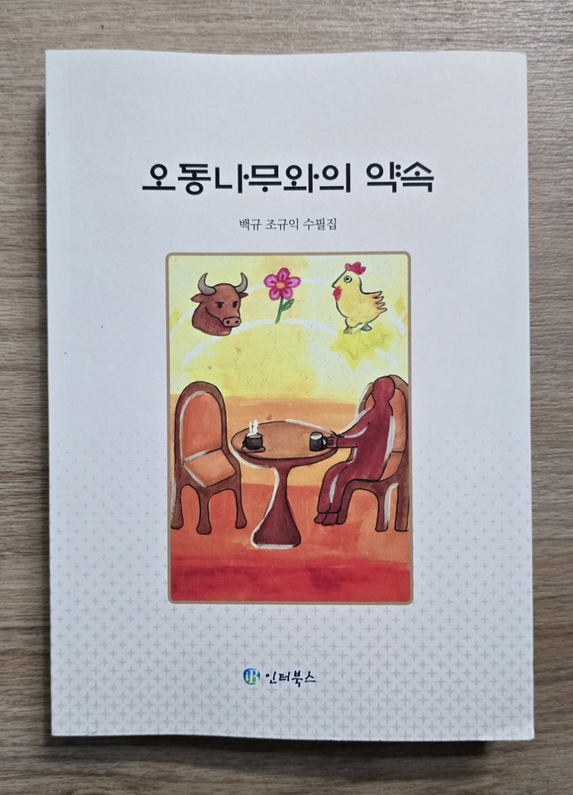

​

-<<오동나무와의 약속>>을 읽고-

​

​

임정옥(임계린/문학박사)

​

선배님, 수필집 잘 받자왔습니다. 한동안 백규 선배님의 가르침 속에 살게 될 것 같습니다! 감사합니다. 표지 그림이 참 다정하고 좋습니다!조영빈 학생이 사진 속 주인공이겠지요? ^^[제1신:편집자주]

높고 넓고 깊은 식견이 보석처럼 빛나는 에세이를 읽을 때는 "아하, 역시!"하며 감탄하고, 곡진한 느낌을 표현한 생활 체험 수필들을 읽을 때는 "이렇게 다정다감한 분이었어?" 하며 감탄하며 읽고 있습니다. 저는 시집과 수필집을 읽을 때는 처음부터 차근차근 읽는 것이 아니라 책상 앞에 앉을 때마다 펼쳐지는(집히는) 한 편 한 편을 읽으면 더 좋더라고요.^^[제2신:편집자주]

- 한 사람의 수필집을 읽으면 --

림 계 린

수필을

읽는 것은

마음 담그고

냇물을 건너기

수심은

깊어지고

공감도 되면

냇물과 흐르지

\*\* 참된 교수로 학자로 사시다가 정년 가까운 즈음에 에코팜을 마련하시고, 오가며 농사를 지으셨다고 하셨다. 명예로운 정년 퇴임 후에는 "에코팜" 한가운데 "백규서옥"을 지으시고 귀농을 하셨다고 하셨다. 백규 조규익 선배님은 대학 같은 과의 1년 선배님이시다. 에코팜 생활 5년만에 집필하신 수필집 <오동나무와의 약속>을 보내주시어 감명 깊게 읽었다. 명퇴 후 10여년 동안 전원에서 치악산 농부를 자처하며 살기도 했고, 대학 강단에 발 디디고 학구열의 훈풍을 맞아보아서인지 더 공감하는 바가 컸던 듯하다. 한 편 한 편 읽으며 "수필의 힘"을 새삼 느끼게 해준 고마운 선배님의 선물이었다. \*\*[제3신:편집자주]